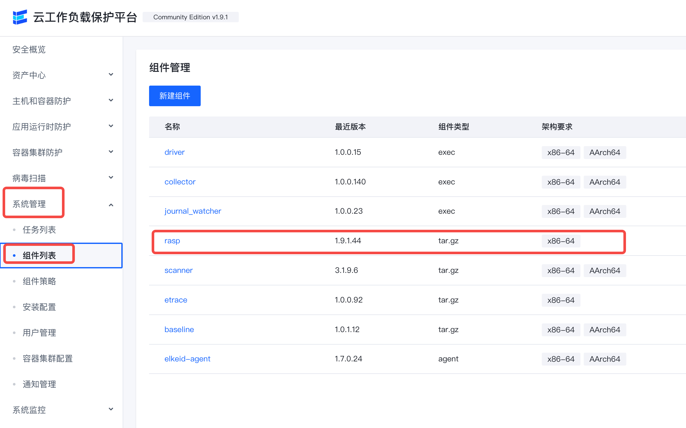
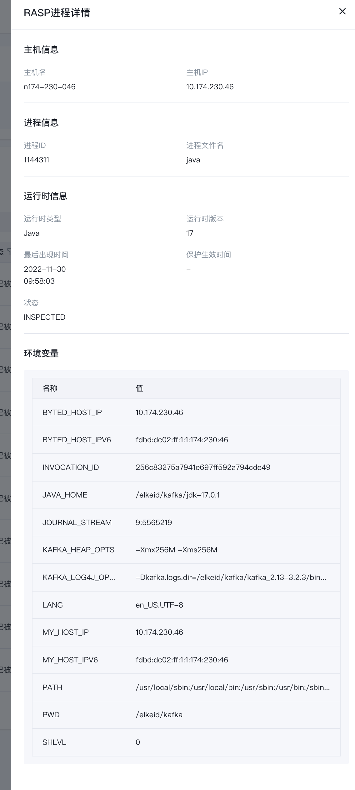
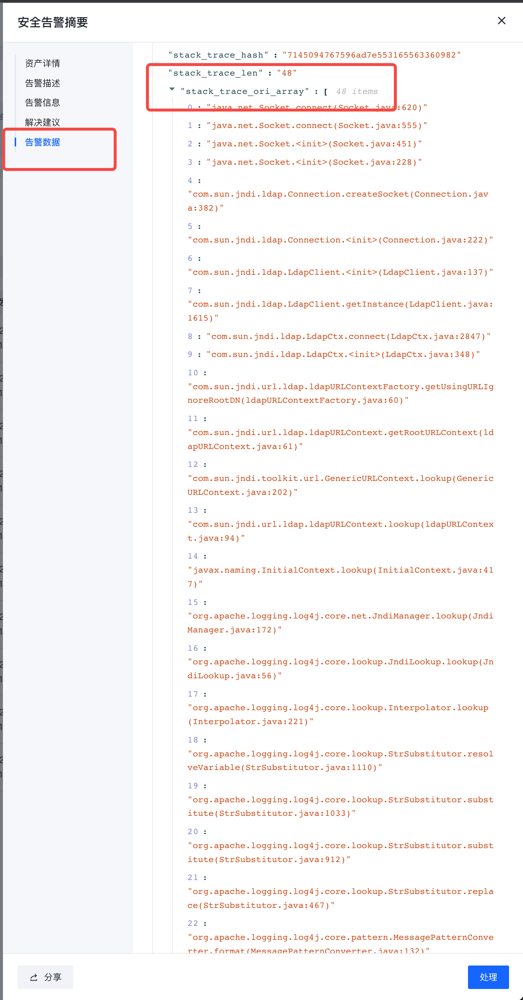

# Elkeid CWPP 应用运行时防护 （RASP） 使用指南

> 本指南涵盖以下功能：
> - 通过 CWPP 对 应用运行时 组件进行运维。
> - 控制 RASP 植入探针到目标进程中，完成运行时行为采集。
>  - 植入配置
>  - 阻断/过滤 配置
> - 查看 CWPP 的告警事件。

## 安装/更新 RASP 组件

1. 确保组件列表中包含 rasp 组件。

如果没有 rasp 组件，需要新建组件，组件名为 rasp。

> 注意！由于 Agent 机制，插件名称与插件二进制名称应该一致。

发布版本，上传 tar.gz 格式的压缩包。
请使用 `1.9.1.*` 版本的插件。
压缩包地址：[bytedance/Elkeid: releases](https://github.com/bytedance/Elkeid/releases)

2. 确保组件策略中包含 rasp 组件

3. 同步策略到机器。

## 运行状态
部署 RASP 组件后，RASP 将会自动分析机器进程，对符合植入探针条件的进程信息将会上报到 运行状态。

右侧详情链接支持查看进程其他信息

## 配置
配置哪些进程将会开启 RASP 保护

点击新建配置

每条配置的各表单项目间为与的关系
每条配置间为或的关系

|表单项目|是否必选|含义解释|备注|
|--------|--------|--------|----|
|主机标签|否|划定本条配置的适用的主机标签范围|主机标签与资产管理中的标签一致|
|IP|否|对机器IP进行匹配||
|进程命令行|否|对进程命令行进行正则匹配||
|环境变量|否|对进程的环境变量进行匹配|可多个环境变量 多个间为与的关系|
|运行时类型|是|本条配置适用于哪种运行时|可多选|
|是否开启注入|是|本条配置筛选的进程是否开启 RASP 防护|默认为否|

每条配置还可以配置阻断与过滤
- 阻断：对某个Hook函数的某个参数进行正则表达式匹配
  - 正则表达式匹配到时，函数抛出异常阻断该函数运行。
  - 正则表达式没有匹配到时，函数正常运行。
- 过滤：对某个Hook函数的参数进行正则表达式匹配
  - 包含：只上报匹配到的参数数据
  - 不包含：只上报匹配到以外的参数数据

## 入侵检测

RASP 探针植入目标进程后，将会持续上报应用行为，发现异常行为后将会产生事件与告警。

- 右侧告警数据可以检查参数详情与调用栈

