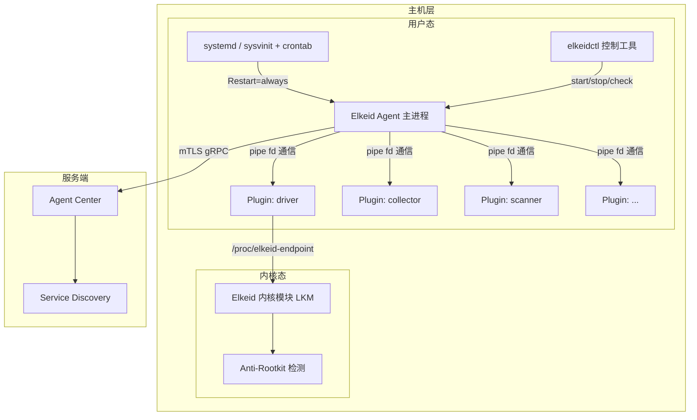
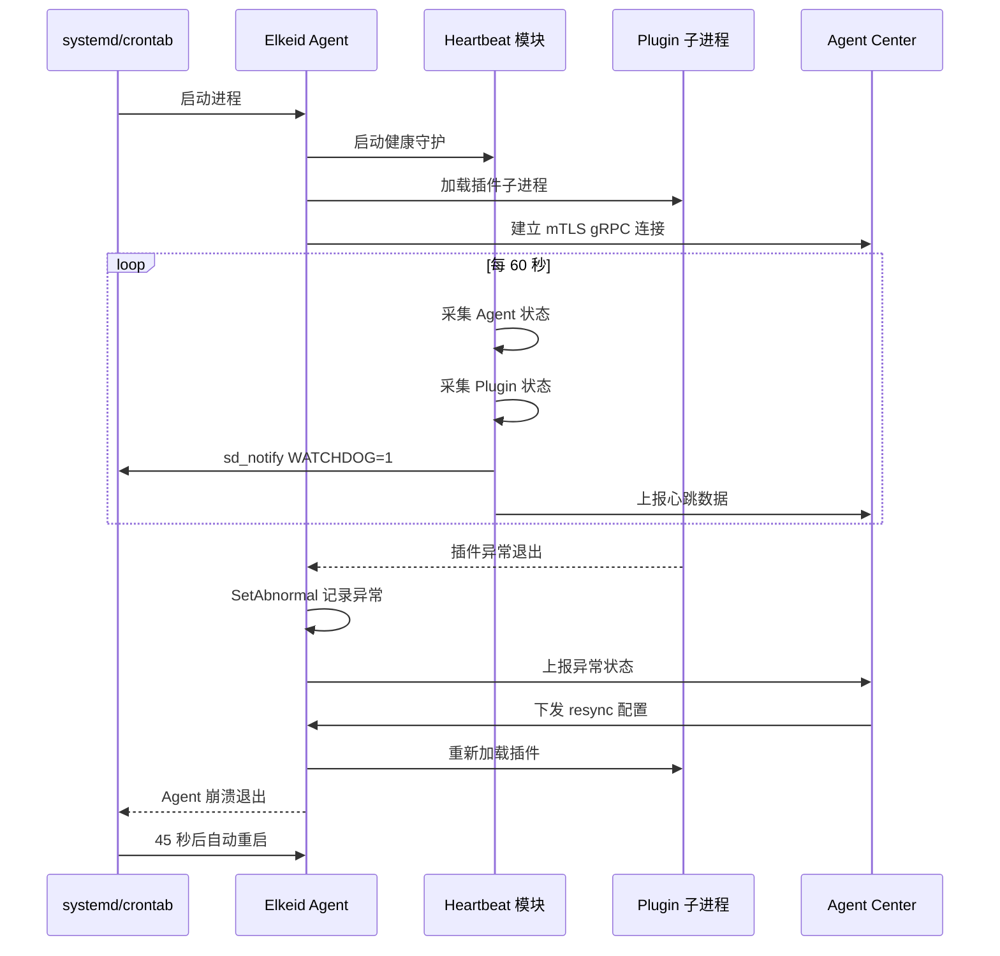
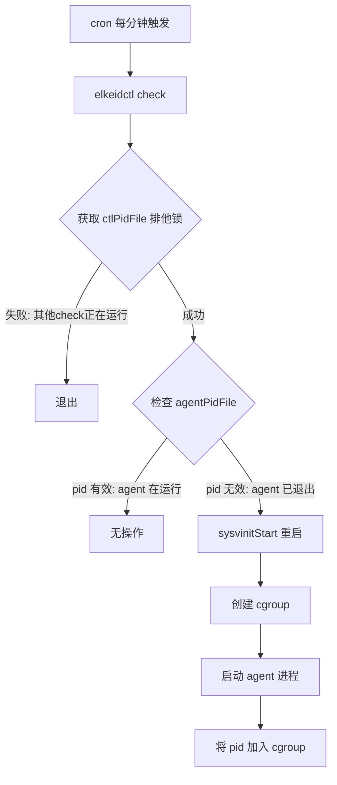
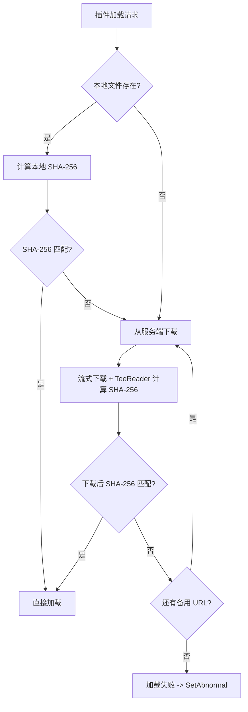
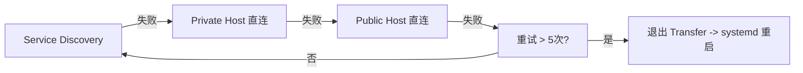

# Elkeid 进程稳定性保障机制 -- 深度技术分析

> 日期：2026-03-24
> 基于项目：[Elkeid](https://github.com/bytedance/Elkeid) (fork)
> 分析范围：Agent 端进程稳定性、自保护、可剥离公共库方案

---

## 目录

- [1. 概述](#1-概述)
- [2. 架构总览](#2-架构总览)
- [3. 进程守护机制详解](#3-进程守护机制详解)
  - [3.1 systemd 守护（主流场景）](#31-systemd-守护主流场景)
  - [3.2 sysvinit + crontab 双重守护（兼容场景）](#32-sysvinit--crontab-双重守护兼容场景)
  - [3.3 sd_notify Watchdog 集成](#33-sd_notify-watchdog-集成)
  - [3.4 三种守护方式优缺点对比](#34-三种守护方式优缺点对比)
- [4. 资源管控机制](#4-资源管控机制)
  - [4.1 systemd 原生资源限制](#41-systemd-原生资源限制)
  - [4.2 cgroup v1 手动管控（sysvinit 场景）](#42-cgroup-v1-手动管控sysvinit-场景)
- [5. 插件完整性校验与生命周期管理](#5-插件完整性校验与生命周期管理)
  - [5.1 SHA-256 完整性校验](#51-sha-256-完整性校验)
  - [5.2 插件生命周期管理](#52-插件生命周期管理)
- [6. 内核模块自保护机制](#6-内核模块自保护机制)
  - [6.1 EXIT_PROTECT -- 阻止内核模块卸载](#61-exit_protect----阻止内核模块卸载)
  - [6.2 Trusted Agent -- 控制通道访问控制](#62-trusted-agent----控制通道访问控制)
  - [6.3 二进制执行拦截（binfmt）](#63-二进制执行拦截binfmt)
- [7. 通信安全](#7-通信安全)
- [8. 状态监控与异常上报](#8-状态监控与异常上报)
- [9. HIDS 进程保护增强建议](#9-hids-进程保护增强建议)
- [10. 可剥离公共库方案](#10-可剥离公共库方案)
  - [10.1 进程守护框架库 -- daemon-guard](#101-进程守护框架库----daemon-guard)
  - [10.2 cgroup 资源管控库 -- cgroupctl](#102-cgroup-资源管控库----cgroupctl)
  - [10.3 二进制完整性校验库 -- integrity](#103-二进制完整性校验库----integrity)
  - [10.4 优雅信号处理库 -- sighandler](#104-优雅信号处理库----sighandler)
- [11. 附录：关键代码清单](#11-附录关键代码清单)

---

## 1. 概述

Elkeid 是字节跳动开源的企业级 HIDS（Host-based Intrusion Detection System）系统。作为部署在每台主机上的安全基础设施，Agent 进程的**稳定性**是整个系统的基石。如果 Agent 进程异常退出、被恶意杀死、或因资源耗尽而不可用，主机就会失去安全监控能力，形成安全盲区。

Elkeid 在进程稳定性方面采用了**多层纵深防御**的设计思路，主要包含以下几个维度：

| 维度 | 实现机制 | 保护目标 |
|------|----------|----------|
| 进程守护 | systemd / sysvinit + crontab | 崩溃自动重启、开机自启 |
| 资源管控 | cgroup v1 / systemd 资源限制 | 防止资源耗尽影响宿主机 |
| 完整性校验 | SHA-256 签名校验 | 防止插件二进制被篡改 |
| 内核自保护 | EXIT_PROTECT / trusted agent | 防止内核模块被卸载、通道被劫持 |
| 通信安全 | mTLS gRPC | 防止通信被劫持或伪造 |
| 状态感知 | heartbeat + 异常上报 | 及时发现异常状态 |

本文将逐一分析每个机制的实现细节，结合源代码进行深度解析，并最终给出可剥离为独立公共库的方案和详细的接入指南。

---

## 2. 架构总览

Elkeid Agent 端的进程稳定性架构如下：



Agent 主进程的稳定性保障涉及以下关键数据流：



---

## 3. 进程守护机制详解

### 3.1 systemd 守护（主流场景）

systemd 是 Elkeid Agent 在现代 Linux 发行版上的**首选守护方案**。

#### 3.1.1 Service 文件配置

源文件位于 `agent/deploy/elkeid-agent.service`：

```ini
[Unit]
Description=elkeid-agent
Wants=network-online.target
After=network-online.target network.target syslog.target

[Service]
Type=simple
ExecStart=/etc/elkeid/elkeid-agent
WorkingDirectory=/etc/elkeid
Restart=always
RestartSec=45
KillMode=control-group
MemoryMax=250M
MemoryLimit=250M
CPUQuota=10%
Delegate=yes
EnvironmentFile=-/etc/elkeid/specified_env

[Install]
WantedBy=multi-user.target
```

**关键配置项解析**：

| 配置项 | 值 | 作用 |
|--------|-----|------|
| `Type=simple` | simple | Agent 以前台进程方式运行，systemd 直接监控主进程 |
| `Restart=always` | always | **核心**：无论正常退出还是异常退出，systemd 都会自动重启 Agent |
| `RestartSec=45` | 45秒 | 重启间隔，防止频繁重启导致系统资源抖动 |
| `KillMode=control-group` | control-group | 停止时 kill 整个 cgroup 内的所有进程（包括插件子进程） |
| `MemoryMax=250M` | 250MB | systemd 级别内存上限（cgroup v2） |
| `MemoryLimit=250M` | 250MB | 兼容 cgroup v1 的内存限制 |
| `CPUQuota=10%` | 10% | CPU 使用率上限 |
| `Delegate=yes` | yes | 允许 Agent 在其 cgroup 下创建子 cgroup |
| `EnvironmentFile=-/etc/elkeid/specified_env` | - | 加载环境变量文件，前缀 `-` 表示文件不存在时不报错 |
| `After=network-online.target` | - | 确保网络就绪后再启动 Agent |

#### 3.1.2 服务注册与启用

通过 `elkeidctl` 工具注册服务。代码位于 `agent/deploy/control/cmd/enable.go`：

```go
// systemd 模式：直接调用 systemctl enable
var enableCmd = &cobra.Command{
    Use:   "enable",
    Run: func(cmd *cobra.Command, args []string) {
        if viper.GetString("service_type") == "systemd" {
            cmd := exec.Command("systemctl", "enable", serviceFile)
            cmd.Stdout = os.Stdout
            cmd.Stderr = os.Stderr
            cobra.CheckErr(cmd.Run())
        } else if viper.GetString("service_type") == "sysvinit" {
            // 尝试 update-rc.d 或 chkconfig
            _, err := exec.LookPath("update-rc.d")
            if err == nil {
                res, err := exec.Command("update-rc.d", serviceName, "defaults").CombinedOutput()
                // ...
                return
            }
            _, err = exec.LookPath("chkconfig")
            if err == nil {
                res, err := exec.Command("chkconfig", "--add", serviceName).CombinedOutput()
                // ...
            }
        }
    },
}
```

安装脚本 `agent/deploy/scripts/postinstall.sh` 中的完整安装流程：

```bash
enable_service() {
    if command -v systemctl > /dev/null 2>&1; then
        expect "${root_dir}/${agent_ctl} set --service_type=systemd"
    else
        expect "mkdir -p ${sysvinit_dir}"
        expect "mkdir -p /etc/cron.d"
        expect "cp ${root_dir}/${sysvinit_script} ${sysvinit_dir}/${product_name}"
        expect "${root_dir}/${agent_ctl} set --service_type=sysvinit"
    fi
    expect "${root_dir}/${agent_ctl} enable"
}
```

逻辑非常清晰：优先检测 `systemctl` 命令是否存在，存在则使用 systemd 模式，否则降级为 sysvinit 模式。

#### 3.1.3 启动/停止/重启

代码位于 `agent/deploy/control/cmd/start.go`、`stop.go`、`restart.go`：

**启动**（systemd 模式仅一行）：
```go
cmd := exec.Command("systemctl", "start", serviceName)
```

**停止**（systemd 模式仅一行）：
```go
cmd := exec.Command("systemctl", "stop", serviceName)
```

**重启**（systemd 模式仅一行）：
```go
cmd := exec.Command("systemctl", "restart", serviceName)
```

systemd 模式下 `elkeidctl` 实质上是 `systemctl` 的薄封装，真正的进程生命周期管理完全交给 systemd。

### 3.2 sysvinit + crontab 双重守护（兼容场景）

对于不支持 systemd 的旧版 Linux（如 CentOS 6、部分嵌入式系统），Elkeid 设计了 **sysvinit + crontab** 的双重守护方案。

#### 3.2.1 sysvinit 启动脚本

源文件位于 `agent/deploy/scripts/elkeid-agent.sysvinit`：

```sh
#!/bin/sh
### BEGIN INIT INFO
# Provides:             elkeid-agent
# Required-Start:       $local_fs $network $syslog
# Required-Stop:        $local_fs $network $syslog
# Default-Start:        2 3 4 5
# Default-Stop:         0 1 6
# Short-Description:    elkeid-agent
### END INIT INFO

control="/etc/elkeid/elkeidctl"
case "$1" in
    start)  "${control}" start ;;
    stop)   "${control}" stop ;;
    restart) "${control}" restart ;;
    status) "${control}" status ;;
    *)
    echo "Usage: $0 {start|stop|restart|status}"
    exit 1
    ;;
esac
exit 0
```

脚本本身仅作为统一入口，所有操作转发给 `elkeidctl`。

#### 3.2.2 sysvinit 模式的进程启动

代码位于 `agent/deploy/control/cmd/start.go` 中的 `sysvinitStart()`：

```go
func sysvinitStart() error {
    var err error
    // 创建 cgroup 资源限制
    cgroup, err := NewCGroup(serviceName)
    if err != nil {
        fmt.Fprintf(os.Stderr, "failed to create cgroup(even named): %v\n", err.Error())
    }
    // 启动 agent 进程
    cmd := exec.Command(agentFile)
    cmd.Dir = agentWorkDir
    cmd.SysProcAttr = &syscall.SysProcAttr{
        Setpgid: true,  // 创建独立进程组
    }
    // 注入环境变量
    for k, v := range viper.AllSettings() {
        cmd.Env = append(cmd.Env, k+"="+v.(string))
    }
    cmd.Env = append(cmd.Env, "PATH=/usr/local/sbin:/usr/local/bin:/usr/sbin:/usr/bin:/sbin:/bin")
    err = cmd.Start()
    if err != nil {
        return err
    }
    // 将新进程加入 cgroup
    if cgroup != nil {
        err = cgroup.AddProc(cmd.Process.Pid)
        if err != nil {
            fmt.Fprintf(os.Stderr, "failed to add proc to cgroup: %v\n", err.Error())
        }
    }
    return nil
}
```

关键设计点：
1. `Setpgid: true` 创建独立进程组，使得后续可以通过 `kill(-pgid, SIGTERM)` 一次性终止 agent 及其所有子进程
2. 先启动进程再加入 cgroup（因为 cgroup 需要 pid）
3. 通过 Viper 注入环境变量，包括 `service_type=sysvinit`

#### 3.2.3 PID 文件锁防重复启动

Agent 主进程在 sysvinit 模式下使用 PID 文件锁，代码位于 `agent/main.go`：

```go
const (
    pidFile = "/var/run/elkeid-agent.pid"
)

func main() {
    // ...
    if os.Getenv("service_type") == "sysvinit" {
        l, _ := lockfile.New(pidFile)
        if err := l.TryLock(); err != nil {
            zap.S().Error(err)
            return  // 已有实例运行，直接退出
        }
    }
    // ...
}
```

使用 `github.com/nightlyone/lockfile` 库实现跨进程文件锁。systemd 模式不需要此锁，因为 systemd 自身保证单实例。

#### 3.2.4 crontab 定时健康检查 -- 核心守护逻辑

这是 sysvinit 方案中最关键的保活机制。定义在 `agent/deploy/control/cmd/root.go`：

```go
const (
    crontabContent = "* * * * * root /etc/elkeid/elkeidctl check\n"
    crontabFile    = "/etc/cron.d/" + serviceName
)
```

每分钟由 cron 执行 `elkeidctl check`，其逻辑位于 `agent/deploy/control/cmd/check.go`：

```go
var checkCmd = &cobra.Command{
    Use:   "check",
    Run: func(cmd *cobra.Command, args []string) {
        if viper.GetString("service_type") == "sysvinit" {
            // 获取 elkeidctl 自身的排他锁，防止多个 check 并发执行
            ctlFile, _ := lockfile.New(ctlPidFile)
            err := ctlFile.TryLock()
            if err != nil {
                cobra.CheckErr(fmt.Errorf("get ctl file lock failed: %v", err))
            }
            defer ctlFile.Unlock()

            // 检查 agent pid 文件是否有效
            file, _ := lockfile.New(agentPidFile)
            _, err = file.GetOwner()
            if err != nil {
                // pid 文件无效 -> agent 已退出 -> 重新启动
                err := sysvinitStart()
                if err != nil {
                    ctlFile.Unlock()
                    cobra.CheckErr(fmt.Errorf("start service failed: %v", err))
                }
            } else {
                // TODO: zombie state check
            }
        }
    },
}
```

**工作流程**：



crontab 文件在启动时注册（`start.go`），停止时删除（`stop.go`）：

```go
// start 时注册
cobra.CheckErr(os.WriteFile(crontabFile, []byte(crontabContent), 0600))
exec.Command("service", "cron", "restart").Run()
exec.Command("service", "crond", "restart").Run()

// stop 时删除
os.RemoveAll(crontabFile)
exec.Command("service", "cron", "restart").Run()
exec.Command("service", "crond", "restart").Run()
```

#### 3.2.5 sysvinit 停止流程 -- 优雅退出

代码位于 `agent/deploy/control/cmd/stop.go`：

```go
func sysvinitStop() error {
    os.RemoveAll(crontabFile)  // 先移除 crontab，防止被重新拉起
    file, err := lockfile.New(agentPidFile)
    if err != nil {
        return err
    }
    p, err := file.GetOwner()
    if err == nil {
        var pids []int
        pids, err := GetProcs(p.Pid)  // 获取所有相关进程
        if err != nil {
            return err
        }
        // 第一阶段：发送 SIGTERM 优雅退出
        for _, pid := range pids {
            syscall.Kill(-pid, syscall.SIGTERM)
        }
        // 等待进程退出，超时 30 秒
        ticker := time.NewTicker(time.Millisecond * time.Duration(100))
        timeout := time.NewTimer(time.Second * time.Duration(30))
        for {
            select {
            case <-ticker.C:
                pids = CheckPids(pids)
                if len(pids) == 0 {
                    return nil
                }
            case <-timeout.C:
                // 第二阶段：超时后强制 SIGKILL
                for _, pid := range pids {
                    syscall.Kill(-pid, syscall.SIGKILL)
                }
                return nil
            }
        }
    }
    return nil
}
```

进程发现采用双重策略，代码位于 `stop.go` 中的 `GetProcs()`：

```go
func GetProcs(pid int) (res []int, err error) {
    // 策略1：从 cgroup 获取（更准确）
    res, err = GetProcsFromCGroup()
    if err == nil && len(res) != 0 {
        return
    }
    // 策略2：从 /proc 遍历进程树（fallback）
    return GetProcsFromProc(pid)
}
```

### 3.3 sd_notify Watchdog 集成

Elkeid 在心跳模块中预埋了 systemd watchdog 支持。代码位于 `agent/heartbeat/heartbeat.go`：

```go
import "github.com/coreos/go-systemd/daemon"

func getAgentStat(now time.Time) {
    // ... 采集各种状态指标 ...
    
    // 向 systemd 发送 watchdog 心跳
    daemon.SdNotify(false, "WATCHDOG=1")
    
    buffer.WriteRecord(rec)
}

func Startup(ctx context.Context, wg *sync.WaitGroup) {
    defer wg.Done()
    zap.S().Info("health daemon startup")
    getAgentStat(time.Now())
    ticker := time.NewTicker(time.Minute)  // 每 60 秒
    defer ticker.Stop()
    for {
        select {
        case <-ctx.Done():
            return
        case t := <-ticker.C:
            host.RefreshHost()
            getAgentStat(t)   // 在此函数内发送 WATCHDOG=1
            getPlgStat(t)
        }
    }
}
```

**当前状态**：代码已预埋 `WATCHDOG=1` 通知，但 service 文件中**未配置 `WatchdogSec`**，因此 watchdog 功能实际未激活。若要启用，需在 service 文件中添加：

```ini
[Service]
WatchdogSec=120   # 建议为心跳间隔的 2 倍（60s * 2 = 120s）
```

启用后，如果 Agent 在 120 秒内未发送 `WATCHDOG=1`（即心跳模块卡死），systemd 会强制杀死并重启 Agent。这能检测到 Agent 进程虽然存在但已"僵死"（如 deadlock）的情况。

### 3.4 三种守护方式优缺点对比

| 特性 | systemd | sysvinit + crontab | sd_notify watchdog |
|------|---------|-------------------|--------------------|
| **检测精度** | 进程退出即触发 | 最长 60 秒延迟（cron 周期） | 可配置（秒级） |
| **僵死检测** | 不支持（仅检测进程存活） | 不支持（仅检测 pid 文件） | **支持**（心跳超时即判定僵死） |
| **重启速度** | 45 秒（RestartSec） | 60 秒内 | 取决于 WatchdogSec |
| **资源管控** | 原生 cgroup 集成 | 需手动创建 cgroup | 不涉及 |
| **开机自启** | systemctl enable | update-rc.d / chkconfig | 不涉及 |
| **系统兼容性** | 仅 systemd 系统 | 几乎所有 Linux | 仅 systemd 系统 |
| **依赖** | systemd | cron + lockfile | systemd + go-systemd 库 |
| **单实例保证** | systemd 原生保证 | pid 文件锁 + ctlPidFile 排他锁 | 不涉及 |
| **适用场景** | 现代 Linux（CentOS 7+，Ubuntu 16+） | 旧版 Linux（CentOS 6 等） | 补充 systemd 守护 |

**最佳实践建议**：对于生产环境，推荐同时启用 systemd 守护（`Restart=always`）和 watchdog（`WatchdogSec`），形成"进程死亡 -> 重启"+"进程僵死 -> 重启"的双重保障。

---

## 4. 资源管控机制

资源管控确保 Agent 不会因 bug 或恶意输入而消耗过多系统资源，影响宿主机上的业务进程。

### 4.1 systemd 原生资源限制

在 service 文件中直接配置：

```ini
MemoryMax=250M      # cgroup v2 内存上限
MemoryLimit=250M    # cgroup v1 内存上限（兼容）
CPUQuota=10%        # CPU 使用率上限
Delegate=yes        # 允许 Agent 管理子 cgroup
```

- `MemoryMax` + `MemoryLimit` 同时配置，兼容 cgroup v1 和 v2
- `CPUQuota=10%` 表示在一个 CPU 周期内最多使用 10% 的 CPU 时间
- `Delegate=yes` 允许 Agent 在 systemd 为其创建的 cgroup 下进一步创建子 cgroup（用于插件隔离等场景）

当 Agent 内存超过 250MB 时，Linux OOM killer 会终止 Agent 进程，随后 systemd 的 `Restart=always` 会自动重启它。

### 4.2 cgroup v1 手动管控（sysvinit 场景）

在无 systemd 的环境中，Elkeid 通过 `elkeidctl` 手动创建和管理 cgroup。核心代码位于 `agent/deploy/control/cmd/cgroup.go`。

#### 4.2.1 cgroup 检测与挂载

```go
func CheckCGroup() (rootNamedPath, rootCPUPath, rootMemoryPath string, 
    cpu, memory bool, err error) {
    // 1. 检查 /proc/cgroups 确认内核是否启用了 cpu 和 memory 子系统
    f, err := os.Open("/proc/cgroups")
    // ...
    for scanner.Scan() {
        fields := strings.Fields(strings.TrimSpace(scanner.Text()))
        if fields[0] == "cpu" && fields[3] == "1" {
            cpu = true
        }
        if fields[0] == "memory" && fields[3] == "1" {
            memory = true
        }
    }

    // 2. 从 /proc/self/mountinfo 获取各子系统的挂载点
    f, err = os.Open("/proc/self/mountinfo")
    // ...
    for scanner.Scan() {
        if fields[len(fields)-3] == "cgroup" {
            subsystems := strings.Split(fields[len(fields)-1], ",")
            for _, s := range subsystems {
                if s == "cpu"       { rootCPUPath = fields[4] }
                if s == "memory"    { rootMemoryPath = fields[4] }
                if s == "name=all"  { rootNamedPath = fields[4] }
            }
        }
    }
    return
}
```

#### 4.2.2 cgroup 创建与资源限制设置

```go
func NewCGroup(path string) (*CGroup, error) {
    rootNamedPath, rootCPUPath, rootMemoryPath, cpu, memory, err := CheckCGroup()
    // ...
    cgroup := &CGroup{readOnly: false}

    // 创建 named cgroup（若不存在则手动挂载）
    if rootNamedPath == "" {
        rootNamedPath = filepath.Join(cgroupPath, "named")
        os.MkdirAll(rootNamedPath, 0o0700)
        cmd := exec.Command("mount", "-t", "cgroup", "-o", "none,name=all", 
            "cgroup", rootNamedPath)
        cmd.CombinedOutput()
    }
    cgroup.namedPath = filepath.Join(rootNamedPath, path)
    os.MkdirAll(cgroup.namedPath, 0o700)

    // CPU 限制：quota = period / 10（即 10%），最低 10000us
    if cpu {
        cpuPath := filepath.Join(rootCPUPath, path)
        os.MkdirAll(cpuPath, 0o700)
        content, _ := os.ReadFile(filepath.Join(cpuPath, "cpu.cfs_period_us"))
        period, _ := strconv.ParseInt(strings.TrimSpace(string(content)), 10, 64)
        quota := period / 10
        if quota < 10000 {
            quota = 10000
        }
        retryingWriteFile(filepath.Join(cgroup.cpuPath, "cpu.cfs_quota_us"),
            []byte(strconv.FormatInt(quota, 10)), 0o0644)
    }

    // Memory 限制：250MB
    if memory {
        memoryPath := filepath.Join(rootMemoryPath, path)
        os.MkdirAll(memoryPath, 0o700)
        retryingWriteFile(filepath.Join(memoryPath, "memory.limit_in_bytes"),
            []byte(strconv.FormatInt(262144000, 10)), 0o0644)  // 250MB
    }

    return cgroup, nil
}
```

#### 4.2.3 进程归组

```go
func (cgroup *CGroup) AddProc(pid int) (err error) {
    if cgroup.readOnly {
        return ErrReadOnly
    }
    // 将 pid 写入三个子系统的 cgroup.procs
    err = retryingWriteFile(filepath.Join(cgroup.namedPath, "cgroup.procs"),
        []byte(strconv.Itoa(pid)), 0o0644)
    if cgroup.memoryPath != "" {
        err = retryingWriteFile(filepath.Join(cgroup.memoryPath, "cgroup.procs"),
            []byte(strconv.Itoa(pid)), 0o0644)
    }
    if cgroup.cpuPath != "" {
        err = retryingWriteFile(filepath.Join(cgroup.cpuPath, "cgroup.procs"),
            []byte(strconv.Itoa(pid)), 0o0644)
    }
    return
}
```

`retryingWriteFile` 处理了 `EINTR` 重试：

```go
func retryingWriteFile(path string, data []byte, mode os.FileMode) error {
    for {
        err := os.WriteFile(path, data, mode)
        if err == nil {
            return nil
        } else if !errors.Is(err, syscall.EINTR) {
            return err
        }
    }
}
```

#### 4.2.4 cgroup 清理

卸载时需要清理 cgroup，代码位于 `agent/deploy/control/cmd/cleanup.go`：

```go
var cleanupCmd = &cobra.Command{
    Run: func(cmd *cobra.Command, args []string) {
        if viper.GetString("service_type") == "sysvinit" {
            // 清理旧版 cgroup 残留
            exec.Command("umount", "/elkeid-agent/cpu").Run()
            exec.Command("umount", "/elkeid-agent/memory").Run()
            exec.Command("umount", "/elkeid-agent/named").Run()
            os.RemoveAll("/elkeid-agent")

            // 清理 cgroup 中不属于 agent 的进程（异常场景恢复）
            cg, err := NewCGroup(serviceName)
            if err == nil {
                var resetPids []int
                for _, t := range []string{"named", "cpu", "memory"} {
                    if pids, err := cg.GetProcs(t); err == nil {
                        for _, pid := range pids {
                            cwd, _ := os.Readlink(filepath.Join("/proc", 
                                strconv.Itoa(pid), "cwd"))
                            if !strings.HasPrefix(cwd, filepath.Clean(agentWorkDir)) {
                                resetPids = append(resetPids, pid)
                            }
                        }
                    }
                }
                // 将不属于 agent 的进程移回根 cgroup
                if len(resetPids) != 0 {
                    cg, err := NewCGroup("/")
                    if err == nil {
                        for _, pid := range resetPids {
                            cg.AddProc(pid)
                        }
                    }
                }
            }
        }
    },
}
```

---

## 5. 插件完整性校验与生命周期管理

### 5.1 SHA-256 完整性校验

Elkeid 使用 SHA-256 哈希值验证插件二进制的完整性，防止篡改。

#### 5.1.1 本地文件签名校验

代码位于 `agent/utils/download.go`：

```go
func CheckSignature(dst string, sign string) (err error) {
    var f *os.File
    f, err = os.Open(dst)
    if err != nil {
        return
    }
    var signBytes []byte
    signBytes, err = hex.DecodeString(sign)
    if err != nil {
        return
    }
    hasher := sha256.New()
    _, err = io.Copy(hasher, f)
    if err != nil {
        return
    }
    if !bytes.Equal(hasher.Sum(nil), signBytes) {
        err = errors.New("signature doesn't match")
        return
    }
    f.Chmod(0o0700)  // 校验通过后设置可执行权限
    f.Close()
    return
}
```

#### 5.1.2 下载时的流式校验

```go
func Download(ctx context.Context, dst string, config proto.Config) (err error) {
    var checksum []byte
    checksum, err = hex.DecodeString(config.Sha256)
    // ...

    // 先检查本地文件是否已满足要求
    hasher := sha256.New()
    f, err = os.Open(dst)
    if err == nil {
        _, err = io.Copy(hasher, f)
        if err == nil && bytes.Equal(hasher.Sum(nil), checksum) {
            f.Close()
            return  // 本地文件校验通过，无需下载
        }
        f.Close()
    }

    // 下载并流式计算 SHA-256
    for _, rawurl := range config.DownloadUrls {
        // ...
        resp.Body = http.MaxBytesReader(nil, resp.Body, 512*1024*1024)  // 限制 512MB
        hasher.Reset()
        r := io.TeeReader(resp.Body, hasher)  // 边读边计算 hash

        switch config.Type {
        case "tar.gz":
            err = DecompressTarGz(r, filepath.Dir(dst))
        default:
            f, err = os.OpenFile(dst, os.O_CREATE|os.O_RDWR|os.O_TRUNC, 0o0700)
            if err == nil {
                _, err = io.Copy(f, r)
                f.Close()
            }
        }

        if err == nil {
            // 下载完成后校验 hash
            if checksum := hex.EncodeToString(hasher.Sum(nil)); checksum != config.Sha256 {
                err = fmt.Errorf("checksum doesn't match: %s vs %s", checksum, config.Sha256)
            } else {
                break  // 校验通过
            }
        }
    }
    return
}
```

**安全设计要点**：
1. 使用 `io.TeeReader` 实现**流式校验**，不需要下载完再读取一次文件计算 hash，效率更高
2. 支持多 URL fallback（`config.DownloadUrls` 是一个数组）
3. 限制最大下载体积 512MB（`http.MaxBytesReader`）
4. 校验通过后才会被使用，失败则尝试下一个 URL

#### 5.1.3 校验流程图



### 5.2 插件生命周期管理

#### 5.2.1 插件加载

代码位于 `agent/plugin/plugin_linux.go`：

```go
func Load(ctx context.Context, config proto.Config) (plg *Plugin, err error) {
    // 1. 版本检查：相同版本跳过，不同版本先关闭旧的
    loadedPlg, ok := m.Load(config.Name)
    if ok {
        loadedPlg := loadedPlg.(*Plugin)
        if loadedPlg.Config.Version == config.Version && loadedPlg.cmd.ProcessState == nil {
            err = ErrDuplicatePlugin
            return
        }
        if loadedPlg.Config.Version != config.Version && loadedPlg.cmd.ProcessState == nil {
            loadedPlg.Shutdown()  // 关闭旧版本
        }
    }

    // 2. 签名兼容处理
    if config.Signature == "" {
        config.Signature = config.Sha256
    }

    // 3. 完整性校验（校验失败则下载）
    execPath := path.Join(workingDirectory, config.Name)
    err = utils.CheckSignature(execPath, config.Signature)
    if err != nil {
        logger.Warn("check local plugin's signature failed: ", err)
        err = utils.Download(ctx, execPath, config)
        if err != nil {
            return
        }
    }

    // 4. 创建 pipe 通信管道
    rx_r, rx_w, _ := os.Pipe()
    tx_r, tx_w, _ := os.Pipe()

    // 5. 启动子进程
    cmd := exec.Command(execPath)
    cmd.SysProcAttr = &syscall.SysProcAttr{Setpgid: true}  // 独立进程组
    cmd.ExtraFiles = append(cmd.ExtraFiles, tx_r, rx_w)     // fd 3 和 fd 4
    cmd.Dir = workingDirectory
    err = cmd.Start()

    // 6. 注册退出监控
    go func() {
        err = cmd.Wait()
        if !plg.shutdown {
            // 非主动关闭的退出 -> 上报异常
            agent.SetAbnormal(fmt.Sprintf(
                "plugin %v exited with code %v unexpectedly", 
                plg.Name(), cmd.ProcessState.ExitCode()))
        }
        close(plg.done)
    }()

    // 7. 启动数据接收和任务下发 goroutine
    go receiveData(plg)   // 接收插件数据
    go sendTask(plg)      // 向插件发送任务

    m.Store(config.Name, plg)
    return
}
```

#### 5.2.2 插件关闭

```go
func (p *Plugin) Shutdown() {
    p.mu.Lock()
    defer p.mu.Unlock()
    p.shutdown = true
    if p.IsExited() {
        return
    }
    // 1. 关闭通信管道，通知插件退出
    p.tx.Close()
    p.rx.Close()
    // 2. 等待 10 秒超时
    select {
    case <-time.After(time.Second * 10):
        // 超时 -> 强制 SIGKILL 整个进程组
        syscall.Kill(-p.cmd.Process.Pid, syscall.SIGKILL)
        <-p.done
    case <-p.done:
        // 正常退出
    }
}
```

#### 5.2.3 服务端驱动的插件同步

代码位于 `agent/plugin/plugin.go` 的 `Startup()` 函数：

```go
func Startup(ctx context.Context, wg *sync.WaitGroup) {
    defer wg.Done()
    for {
        select {
        case <-ctx.Done():
            // 关闭所有插件
            m.Range(func(key, value any) bool {
                plg := value.(*Plugin)
                go func() {
                    plg.Shutdown()
                    plg.wg.Wait()
                }()
                return true
            })
            return
        case cfgs := <-syncCh:
            // 加载新插件
            for _, cfg := range cfgs {
                plg, err := Load(ctx, *cfg)
                if err == ErrDuplicatePlugin {
                    continue
                }
                if err != nil {
                    agent.SetAbnormal(...)
                }
            }
            // 移除不在配置中的插件
            for _, plg := range GetAll() {
                if _, ok := cfgs[plg.Config.Name]; !ok {
                    plg.Shutdown()
                    m.Delete(plg.Config.Name)
                    os.RemoveAll(plg.GetWorkingDirectory())
                }
            }
        }
    }
}
```

**重要说明**：Elkeid 的插件**崩溃后不会在本地自动重启**。当插件异常退出时，Agent 通过 `SetAbnormal()` 记录异常状态，在下一次心跳上报给服务端。服务端收到异常状态后，会重新下发配置触发 `syncCh`，Agent 收到后重新执行 `Load()` 来恢复插件。这是一种**服务端驱动的恢复策略**。

---

## 6. 内核模块自保护机制

Elkeid 的内核模块（LKM）包含若干自保护机制。

### 6.1 EXIT_PROTECT -- 阻止内核模块卸载

代码位于 `driver/LKM/src/smith_hook.c`：

```c
#define EXIT_PROTECT 0   // 默认关闭
#define SANDBOX 0

#if (EXIT_PROTECT == 1) && defined(MODULE)
static void exit_protect_action(void)
{
    __module_get(THIS_MODULE);  // 增加模块引用计数，阻止 rmmod
}
#endif

// 在模块初始化时调用
static int __init kprobe_hook_init(void)
{
    // ... 初始化 filter、trace 等 ...

#if (EXIT_PROTECT == 1) && defined(MODULE)
    exit_protect_action();
#endif

    install_kprobe();
    // ...
    
    printk(KERN_INFO
        "[ELKEID] ... EXIT_PROTECT: %d\n", EXIT_PROTECT);
    return 0;
}
```

**原理**：`__module_get(THIS_MODULE)` 增加内核模块的引用计数。当引用计数大于 0 时，`rmmod` 命令会报告 "Module is in use" 而拒绝卸载。

**优点**：
- 实现极其简单，一行代码
- 可以阻止普通 `rmmod` 命令

**缺点**：
- 默认关闭（`EXIT_PROTECT 0`），需要编译时启用
- 具有 root 权限的攻击者可以通过修改 `/sys/module/<模块名>/refcnt` 或直接操作内存绕过
- 无法阻止 `rmmod -f`（强制卸载）

### 6.2 Trusted Agent -- 控制通道访问控制

Elkeid 内核模块通过 `/proc/elkeid-endpoint` 提供控制通道。代码位于 `driver/LKM/src/trace.c`：

```c
static int trace_get_control(char *val, K_PARAM_CONST struct kernel_param *kp)
{
    /*
     * 仅使用 task->comm 做简单过滤，用于安全增强和 LTP 兼容。
     * 不使用全路径比较，因为访问 /proc/elkeid-endpoint 本身需要 root 权限。
     *
     * 允许的程序：
     * 1. driver: agent 插件，可能的路径：
     *    - /etc/sysop/mongoosev3-agent/plugin/driver/driver
     *    - /etc/elkeid/plugin/driver/driver
     *    - /opt/proxima/plugin/driver/driver
     * 2. rst: 诊断程序，用于展示内核事件
     *    - .../LKM/test/rst
     */
    char *agents[] = {"driver", "rst", NULL};
    int rc = 0, fd = -1;

    if (strcmp(kp->name, "control_trace"))
        return rc;

    if (smith_is_trusted_agent(agents)) {
        // 受信任进程：返回 pipe fd，可以读取内核事件
        fd = trace_init_pipe();
        rc = scnprintf(val, PAGE_SIZE, "KMOD: " SMITH_VERSION " PIPE: %d\n", fd);
    } else {
        // 非受信任进程：仅返回版本信息
        rc = scnprintf(val, PAGE_SIZE, "%s\n", g_control_trace);
    }
    return rc;
}
```

信任判断逻辑位于 `driver/LKM/src/util.c`：

```c
int smith_is_trusted_agent(char *agents[])
{
    int i;
    for (i = 0; agents[i]; i++) {
        if (strcmp(current->comm, agents[i]) == 0)
            return 1;
    }
    return 0;
}
```

**安全分析**：
- 仅基于 `task->comm`（进程名，最长 15 字符）做判断，**不检查进程全路径**
- 注释中也承认这只是 "simple filtering for both security enhancement"
- 攻击者可以将恶意程序命名为 "driver" 来绕过
- 但前提是攻击者需要 root 权限才能访问 `/proc/elkeid-endpoint`

### 6.3 二进制执行拦截（binfmt）

Elkeid 内核模块注册了自定义的 `linux_binfmt` 处理器，可以在 `execve` 时拦截特定二进制。代码位于 `driver/LKM/src/smith_hook.c`：

```c
static int smith_exec_load(struct linux_binprm *bprm)
{
    char *file_path = (char *)bprm->filename;
    image_hash_t md5 = {0};
    int rc = -ENOEXEC;  // 默认：继续交给下一个 binfmt 处理

    // 1. 计算可执行文件的 MD5
    if (bprm->file) {
        img = smith_find_file_img(bprm->file);
        if (img && !img->si_node.flag_usr1) {
            if (!smith_get_hash_file(bprm->file, &md5) &&
                img->si_size == md5.size) {
                memcpy(&img->si_md5, &md5, sizeof(md5));
                img->si_node.flag_usr1 = 1;  // 缓存 hash
            }
        }
    }

    // 2. 路径/命令行规则匹配
    if (g_flt_ops.rule_check(ei, 4, id)) {
        exe_block_notify(id, file_path, args);
        rc = -EACCES;   // 拦截！
        goto errorout;
    }

    // 3. MD5 哈希黑名单匹配
    if (g_flt_ops.hash_check(&md5)) {
        md5_block_notify(&md5, file_path, args);
        rc = -EACCES;   // 拦截！
        goto errorout;
    }

    return rc;  // -ENOEXEC: 放行
}

static struct linux_binfmt g_smith_exec_load = {
    .module      = THIS_MODULE,
    .load_binary = smith_exec_load,
};
```

MD5 黑名单管理位于 `driver/LKM/src/filter.c`：

```c
struct rb_root image_hash_list = RB_ROOT;

static int image_md5_check(image_hash_t *md5)
{
    unsigned long flags;
    int rc;
    read_lock_irqsave(&image_hash_lock, flags);
    if (md5)
        rc = exist_rb_hash(&image_hash_list, md5);
    else
        rc = (image_hash_list.rb_node != NULL);
    read_unlock_irqrestore(&image_hash_lock, flags);
    return rc;
}

struct filter_ops g_flt_ops = {
    .exe_check = execve_exe_check,   // 可执行文件路径白名单
    .argv_check = execve_argv_check, // 命令行参数规则
    .hash_check = image_md5_check,   // MD5 哈希黑名单
    .rule_check = rule_check,        // 路径/命令黑名单
    .ipv4_check = psad_ip4_check,    // IPv4 白名单
    .ipv6_check = psad_ip6_check,    // IPv6 白名单
};
```

**说明**：这是通用的二进制执行控制（Sandbox 功能），不是专门用于保护 Elkeid 自身。但理论上可以配置规则阻止删除/替换 Elkeid 二进制的操作。

---

## 7. 通信安全

Agent 与服务端之间的通信采用 **mTLS（双向 TLS）** 认证的 gRPC 连接。代码位于 `agent/transport/connection/connection.go`：

```go
func setDialOptions(ca, privkey, cert []byte, svrName string) {
    certPool := x509.NewCertPool()
    certPool.AppendCertsFromPEM(ca)
    keyPair, _ := tls.X509KeyPair(cert, privkey)
    dialOptions = append(dialOptions, 
        grpc.WithTransportCredentials(credentials.NewTLS(&tls.Config{
            Certificates:       []tls.Certificate{keyPair},          // 客户端证书
            ClientAuth:         tls.RequireAndVerifyClientCert,       // 要求双向认证
            RootCAs:            certPool,                             // CA 根证书
            InsecureSkipVerify: true,
            VerifyPeerCertificate: func(rawCerts [][]byte, 
                verifiedChains [][]*x509.Certificate) error {
                // 自定义证书链验证逻辑
                certs := make([]*x509.Certificate, len(rawCerts))
                for i, asn1Data := range rawCerts {
                    cert, _ := x509.ParseCertificate(asn1Data)
                    certs[i] = cert
                }
                opts := x509.VerifyOptions{
                    Roots:         certPool,
                    DNSName:       svrName,          // 验证服务端名称
                    Intermediates: x509.NewCertPool(),
                }
                for _, cert := range certs[1:] {
                    opts.Intermediates.AddCert(cert)
                }
                _, err := certs[0].Verify(opts)
                return err
            },
        })),
        grpc.WithStatsHandler(&DefaultStatsHandler),
        grpc.WithBlock(),
        grpc.WithReturnConnectionError(),
        grpc.FailOnNonTempDialError(true),
    )
}
```

**连接自愈策略**（`agent/transport/transfer.go`）：

```go
func startTransfer(ctx context.Context, wg *sync.WaitGroup) {
    retries := 0
    for {
        conn, err := connection.GetConnection(ctx)
        if err != nil {
            if retries > 5 {
                // 连续 5 次连接失败 -> 主动退出 transfer
                // 这会触发 agent.Cancel()，最终由 systemd 重启整个 Agent
                return
            }
            retries++
            time.Sleep(5 * time.Second)
            continue
        }
        retries = 0
        // 建立双向流...
    }
}
```

**连接策略**采用三级回退：



---

## 8. 状态监控与异常上报

### 8.1 心跳机制

心跳模块（`agent/heartbeat/heartbeat.go`）每 60 秒采集一次 Agent 和插件的运行状态：

**Agent 状态采集（DataType=1000）**：

| 字段 | 来源 | 含义 |
|------|------|------|
| `cpu` | `resource.GetProcResouce()` | Agent CPU 使用率 |
| `rss` | `resource.GetProcResouce()` | 内存占用（RSS） |
| `nfd` | `resource.GetProcResouce()` | 打开的文件描述符数 |
| `ngr` | `runtime.NumGoroutine()` | goroutine 数量 |
| `state` / `state_detail` | `agent.State()` | Agent 状态（running / abnormal） |
| `tx_speed` / `rx_speed` | gRPC 统计 | 网络吞吐 |
| `du` | 目录大小统计 | 磁盘占用 |
| `load_1/5/15` | `/proc/loadavg` | 系统负载 |

**插件状态采集（DataType=1001）**：为每个运行中的插件分别采集 CPU、内存、IO、网络等指标。

### 8.2 异常状态管理

代码位于 `agent/agent/state.go`：

```go
type StateType int32

const (
    StateTypeRunning  StateType = iota
    StateTypeAbnormal
)

var (
    mu           = &sync.Mutex{}
    currentState = StateTypeRunning
    abnormalErrs = []string{}
)

func SetAbnormal(err string) {
    mu.Lock()
    defer mu.Unlock()
    currentState = StateTypeAbnormal
    abnormalErrs = append(abnormalErrs, err)
}

func SetRunning() {
    mu.Lock()
    defer mu.Unlock()
    currentState = StateTypeRunning
    abnormalErrs = []string{}
}

func State() (string, string) {
    mu.Lock()
    defer mu.Unlock()
    err, _ := json.Marshal(abnormalErrs)
    return currentState.String(), string(err)
}
```

**触发 SetAbnormal 的场景**：
1. 插件意外退出：`plugin_linux.go` -- `agent.SetAbnormal(fmt.Sprintf("plugin %v exited with code %v unexpectedly", ...))`
2. 插件加载失败：`plugin.go` -- `agent.SetAbnormal(fmt.Sprintf("load plugin %v failed: %v", ...))`
3. Agent 升级失败：`transfer.go` -- `agent.SetAbnormal(fmt.Sprintf("agent update failed: %v", ...))`

**状态恢复**：当服务端 resync 成功后，`handleReceive` 中调用 `agent.SetRunning()` 将状态恢复为正常。

### 8.3 Agent 自身信号处理

代码位于 `agent/main.go`：

```go
go func() {
    sigs := make(chan os.Signal, 1)
    signal.Notify(sigs, syscall.SIGTERM, syscall.SIGUSR1, syscall.SIGUSR2)
    for {
        switch <-sigs {
        case syscall.SIGTERM:
            // 收到终止信号后延迟 5 秒退出
            // 给插件和 gRPC 连接留出优雅关闭的时间
            <-time.After(time.Second * 5)
            agent.Cancel()

        case syscall.SIGUSR1:
            // 动态开启/关闭 pprof（性能诊断）
            if l == nil {
                l, _ = net.Listen("tcp", "127.0.0.1:")
                go http.Serve(l, nil)
            } else {
                l.Close()
                l = nil
            }

        case syscall.SIGUSR2:
            // 强制释放 OS 内存
            debug.FreeOSMemory()
        }
    }
}()
```

`SIGUSR1` 和 `SIGUSR2` 是非常实用的运维工具：
- `kill -USR1 <pid>`：在生产环境无需重启即可开启 pprof 性能分析
- `kill -USR2 <pid>`：当内存使用偏高时手动触发 GC 归还内存

---

## 9. HIDS 进程保护增强建议

基于对 Elkeid 代码的分析，以下是当前**缺失或可增强**的保护能力：

### 9.1 当前未实现的保护能力

| 能力 | 当前状态 | 风险 |
|------|----------|------|
| 进程防 kill | 未实现 | root 用户可直接 `kill -9` Agent |
| 二进制防篡改 | 仅启动时校验插件 | 运行中 Agent 二进制被替换无法检测 |
| 内核模块防卸载 | EXIT_PROTECT 默认关闭 | `rmmod` 可卸载内核模块 |
| trusted agent 路径校验 | 仅检查 comm 名称 | 伪造进程名即可绕过 |
| 插件本地自动重启 | 不支持 | 插件崩溃后需等待服务端 resync |
| watchdog 僵死检测 | 代码已埋但未启用 | Agent 假死无法检测 |
| 配置文件保护 | 未实现 | /etc/elkeid/ 下的配置文件可被篡改 |

### 9.2 增强建议

#### 9.2.1 启用 systemd Watchdog

这是最简单的改进，只需修改 service 文件：

```ini
[Service]
WatchdogSec=120
```

代码侧已经预埋了 `daemon.SdNotify(false, "WATCHDOG=1")`，无需改动。

#### 9.2.2 插件本地自动重启

当前插件崩溃后依赖服务端 resync，建议在 `plugin_linux.go` 中增加本地重试逻辑：

```go
go func() {
    err = cmd.Wait()
    if !plg.shutdown {
        agent.SetAbnormal(...)
        // 新增：本地自动重启（最多 3 次，指数退避）
        for retry := 0; retry < 3; retry++ {
            time.Sleep(time.Duration(math.Pow(2, float64(retry))) * time.Second)
            if _, err := Load(ctx, plg.Config); err == nil {
                agent.SetRunning()
                break
            }
        }
    }
    close(plg.done)
}()
```

#### 9.2.3 启用 EXIT_PROTECT

编译内核模块时设置：

```c
#define EXIT_PROTECT 1
```

#### 9.2.4 增强 trusted agent 校验

将 `smith_is_trusted_agent` 从仅检查 comm 改为检查进程全路径：

```c
int smith_is_trusted_agent(char *agents[])
{
    char *exe_path;
    char *buf = kmalloc(PATH_MAX, GFP_KERNEL);
    if (!buf)
        return 0;

    exe_path = smith_get_exe_file(current, buf, PATH_MAX);
    if (!exe_path) {
        kfree(buf);
        return 0;
    }

    for (int i = 0; agents[i]; i++) {
        if (strcmp(exe_path, agents[i]) == 0) {
            kfree(buf);
            return 1;
        }
    }
    kfree(buf);
    return 0;
}
```

#### 9.2.5 运行时二进制完整性监控

利用 inotify 或内核模块监控 `/etc/elkeid/` 目录下文件的修改：

```go
func watchBinaryIntegrity(ctx context.Context) {
    watcher, _ := fsnotify.NewWatcher()
    watcher.Add("/etc/elkeid/")
    for {
        select {
        case event := <-watcher.Events:
            if event.Op&(fsnotify.Write|fsnotify.Remove|fsnotify.Rename) != 0 {
                // 检测到文件被修改/删除/重命名 -> 上报告警
                reportTamperAlert(event)
            }
        case <-ctx.Done():
            return
        }
    }
}
```

#### 9.2.6 利用 LSM 钩子保护 Agent 进程

在内核模块中注册 LSM 钩子（如 `security_task_kill`），拦截对 Agent 进程的 kill 操作：

```c
static int elkeid_task_kill(struct task_struct *p, struct kernel_siginfo *info,
                            int sig, const struct cred *cred)
{
    if (is_elkeid_agent(p) && sig == SIGKILL) {
        // 拒绝对 Elkeid Agent 的 SIGKILL
        return -EPERM;
    }
    return 0;
}
```

> 注意：LSM 钩子方案对内核版本有要求，且可能与其他安全模块（SELinux/AppArmor）冲突，需要谨慎评估。

---

## 10. 可剥离公共库方案

以下方案将 Elkeid 中业务无关的稳定性保障能力剥离为独立的 Go 库，供其他项目复用。

### 10.1 进程守护框架库 -- daemon-guard

#### 10.1.1 库设计

```
daemon-guard/
├── go.mod
├── guard.go          # 核心守护逻辑
├── systemd.go        # systemd 相关操作
├── sysvinit.go       # sysvinit + crontab 相关操作
├── service.go        # service 文件生成
├── pidlock.go        # PID 文件锁
└── guard_test.go
```

#### 10.1.2 核心接口定义

```go
package guard

import (
    "context"
    "fmt"
    "os"
    "os/exec"
    "time"

    "github.com/coreos/go-systemd/daemon"
    "github.com/nightlyone/lockfile"
)

// ServiceConfig 定义服务配置
type ServiceConfig struct {
    Name            string        // 服务名称，如 "my-agent"
    Description     string        // 服务描述
    ExecPath        string        // 可执行文件路径
    WorkingDir      string        // 工作目录
    RestartPolicy   string        // 重启策略: "always", "on-failure", "no"
    RestartDelaySec int           // 重启延迟（秒）
    MemoryMax       string        // 内存上限，如 "250M"
    CPUQuota        string        // CPU 配额，如 "10%"
    WatchdogSec     int           // watchdog 超时（秒），0 表示不启用
    EnvFile         string        // 环境变量文件路径
    DelegateSubTree bool          // 是否允许创建子 cgroup
}

// GuardType 守护类型
type GuardType int

const (
    GuardSystemd  GuardType = iota // systemd 守护
    GuardSysvinit                  // sysvinit + crontab 守护
)

// Guard 进程守护器
type Guard struct {
    config    ServiceConfig
    guardType GuardType
    pidLock   lockfile.Lockfile
}

// New 创建守护器，自动检测系统类型
func New(config ServiceConfig) (*Guard, error) {
    g := &Guard{config: config}

    // 自动检测守护类型
    if _, err := exec.LookPath("systemctl"); err == nil {
        g.guardType = GuardSystemd
    } else {
        g.guardType = GuardSysvinit
    }

    return g, nil
}

// Install 安装服务（生成 service 文件、注册开机自启）
func (g *Guard) Install() error {
    switch g.guardType {
    case GuardSystemd:
        return g.installSystemd()
    case GuardSysvinit:
        return g.installSysvinit()
    }
    return fmt.Errorf("unsupported guard type: %d", g.guardType)
}

// Start 启动服务
func (g *Guard) Start() error {
    switch g.guardType {
    case GuardSystemd:
        return exec.Command("systemctl", "start", g.config.Name).Run()
    case GuardSysvinit:
        return g.sysvinitStart()
    }
    return nil
}

// Stop 停止服务
func (g *Guard) Stop() error {
    switch g.guardType {
    case GuardSystemd:
        return exec.Command("systemctl", "stop", g.config.Name).Run()
    case GuardSysvinit:
        return g.sysvinitStop()
    }
    return nil
}

// Restart 重启服务
func (g *Guard) Restart() error {
    switch g.guardType {
    case GuardSystemd:
        return exec.Command("systemctl", "restart", g.config.Name).Run()
    case GuardSysvinit:
        if err := g.sysvinitStop(); err != nil {
            return err
        }
        return g.sysvinitStart()
    }
    return nil
}

// Uninstall 卸载服务（停止 + 移除配置）
func (g *Guard) Uninstall() error {
    g.Stop()
    switch g.guardType {
    case GuardSystemd:
        return g.uninstallSystemd()
    case GuardSysvinit:
        return g.uninstallSysvinit()
    }
    return nil
}

// EnsureSingleInstance 确保单实例运行（在 main 函数开头调用）
// 仅 sysvinit 模式需要，systemd 模式由 systemd 保证
func (g *Guard) EnsureSingleInstance(pidFile string) error {
    if g.guardType != GuardSysvinit {
        return nil
    }
    l, err := lockfile.New(pidFile)
    if err != nil {
        return err
    }
    g.pidLock = l
    return l.TryLock()
}

// NotifyWatchdog 发送 watchdog 心跳（在心跳循环中调用）
func NotifyWatchdog() {
    daemon.SdNotify(false, "WATCHDOG=1")
}

// NotifyReady 通知 systemd 服务已就绪
func NotifyReady() {
    daemon.SdNotify(false, "READY=1")
}
```

#### 10.1.3 systemd Service 文件生成

```go
package guard

import (
    "fmt"
    "os"
    "os/exec"
    "path/filepath"
    "text/template"
)

const serviceTemplate = `[Unit]
Description={{.Description}}
Wants=network-online.target
After=network-online.target network.target syslog.target

[Service]
Type=simple
ExecStart={{.ExecPath}}
WorkingDirectory={{.WorkingDir}}
Restart={{.RestartPolicy}}
RestartSec={{.RestartDelaySec}}
KillMode=control-group
{{- if .MemoryMax}}
MemoryMax={{.MemoryMax}}
MemoryLimit={{.MemoryMax}}
{{- end}}
{{- if .CPUQuota}}
CPUQuota={{.CPUQuota}}
{{- end}}
{{- if .DelegateSubTree}}
Delegate=yes
{{- end}}
{{- if gt .WatchdogSec 0}}
WatchdogSec={{.WatchdogSec}}
{{- end}}
{{- if .EnvFile}}
EnvironmentFile=-{{.EnvFile}}
{{- end}}

[Install]
WantedBy=multi-user.target
`

func (g *Guard) installSystemd() error {
    serviceDir := filepath.Dir(g.config.ExecPath)
    servicePath := filepath.Join(serviceDir, g.config.Name+".service")

    tmpl, err := template.New("service").Parse(serviceTemplate)
    if err != nil {
        return err
    }

    f, err := os.OpenFile(servicePath, os.O_CREATE|os.O_WRONLY|os.O_TRUNC, 0644)
    if err != nil {
        return err
    }
    defer f.Close()

    if err := tmpl.Execute(f, g.config); err != nil {
        return err
    }

    // systemctl enable
    cmd := exec.Command("systemctl", "enable", servicePath)
    if out, err := cmd.CombinedOutput(); err != nil {
        return fmt.Errorf("systemctl enable failed: %w: %s", err, string(out))
    }

    // systemctl daemon-reload
    exec.Command("systemctl", "daemon-reload").Run()

    return nil
}

func (g *Guard) uninstallSystemd() error {
    exec.Command("systemctl", "disable", g.config.Name).Run()
    serviceDir := filepath.Dir(g.config.ExecPath)
    servicePath := filepath.Join(serviceDir, g.config.Name+".service")
    os.Remove(servicePath)
    exec.Command("systemctl", "daemon-reload").Run()
    return nil
}
```

#### 10.1.4 sysvinit + crontab 守护实现

```go
package guard

import (
    "fmt"
    "os"
    "os/exec"
    "path/filepath"
    "syscall"
    "time"

    "github.com/nightlyone/lockfile"
)

func (g *Guard) installSysvinit() error {
    // 生成 sysvinit 脚本
    sysvinitPath := filepath.Join("/etc/init.d/", g.config.Name)
    script := fmt.Sprintf(`#!/bin/sh
### BEGIN INIT INFO
# Provides:             %s
# Required-Start:       $local_fs $network $syslog
# Required-Stop:        $local_fs $network $syslog
# Default-Start:        2 3 4 5
# Default-Stop:         0 1 6
### END INIT INFO

CTL="%s"
case "$1" in
    start)  "${CTL}" start ;;
    stop)   "${CTL}" stop ;;
    restart) "${CTL}" restart ;;
    *) echo "Usage: $0 {start|stop|restart}" && exit 1 ;;
esac
exit 0
`, g.config.Name, filepath.Join(g.config.WorkingDir, g.config.Name+"ctl"))

    if err := os.WriteFile(sysvinitPath, []byte(script), 0755); err != nil {
        return err
    }

    // 注册开机自启
    if _, err := exec.LookPath("update-rc.d"); err == nil {
        exec.Command("update-rc.d", g.config.Name, "defaults").Run()
    } else if _, err := exec.LookPath("chkconfig"); err == nil {
        exec.Command("chkconfig", "--add", g.config.Name).Run()
    }

    return nil
}

func (g *Guard) uninstallSysvinit() error {
    g.removeCrontab()
    os.Remove(filepath.Join("/etc/init.d/", g.config.Name))
    return nil
}

func (g *Guard) sysvinitStart() error {
    cmd := exec.Command(g.config.ExecPath)
    cmd.Dir = g.config.WorkingDir
    cmd.SysProcAttr = &syscall.SysProcAttr{Setpgid: true}
    cmd.Env = append(cmd.Env,
        "service_type=sysvinit",
        "PATH=/usr/local/sbin:/usr/local/bin:/usr/sbin:/usr/bin:/sbin:/bin",
    )

    if err := cmd.Start(); err != nil {
        return err
    }

    // 注册 crontab 健康检查
    g.installCrontab()

    return nil
}

func (g *Guard) sysvinitStop() error {
    g.removeCrontab()

    pidFile := fmt.Sprintf("/var/run/%s.pid", g.config.Name)
    file, err := lockfile.New(pidFile)
    if err != nil {
        return err
    }

    p, err := file.GetOwner()
    if err != nil {
        return nil
    }

    // SIGTERM -> 等待 -> SIGKILL
    syscall.Kill(-p.Pid, syscall.SIGTERM)

    deadline := time.After(30 * time.Second)
    ticker := time.NewTicker(100 * time.Millisecond)
    defer ticker.Stop()

    for {
        select {
        case <-ticker.C:
            if err := p.Signal(syscall.Signal(0)); err != nil {
                return nil
            }
        case <-deadline:
            syscall.Kill(-p.Pid, syscall.SIGKILL)
            return nil
        }
    }
}

func (g *Guard) installCrontab() {
    content := fmt.Sprintf("* * * * * root %s check\n",
        filepath.Join(g.config.WorkingDir, g.config.Name+"ctl"))
    crontabFile := filepath.Join("/etc/cron.d/", g.config.Name)
    os.WriteFile(crontabFile, []byte(content), 0600)
    exec.Command("service", "cron", "restart").Run()
    exec.Command("service", "crond", "restart").Run()
}

func (g *Guard) removeCrontab() {
    crontabFile := filepath.Join("/etc/cron.d/", g.config.Name)
    os.RemoveAll(crontabFile)
    exec.Command("service", "cron", "restart").Run()
    exec.Command("service", "crond", "restart").Run()
}

// Check 健康检查（由 crontab 调用）
func (g *Guard) Check() error {
    pidFile := fmt.Sprintf("/var/run/%s.pid", g.config.Name)
    file, err := lockfile.New(pidFile)
    if err != nil {
        return g.sysvinitStart()
    }
    _, err = file.GetOwner()
    if err != nil {
        return g.sysvinitStart()
    }
    return nil
}
```

#### 10.1.5 接入方式 -- 完整示例

**步骤一：安装依赖**

```bash
go get github.com/yourorg/daemon-guard
```

**步骤二：定义服务配置**

```go
package main

import (
    "context"
    "log"
    "os"
    "os/signal"
    "syscall"
    "time"

    guard "github.com/yourorg/daemon-guard"
)

func main() {
    // 1. 定义服务配置
    cfg := guard.ServiceConfig{
        Name:            "my-agent",
        Description:     "My Custom Agent Service",
        ExecPath:        "/opt/my-agent/my-agent",
        WorkingDir:      "/opt/my-agent",
        RestartPolicy:   "always",
        RestartDelaySec: 30,
        MemoryMax:       "200M",
        CPUQuota:        "15%",
        WatchdogSec:     120,
        EnvFile:         "/opt/my-agent/env",
        DelegateSubTree: false,
    }

    // 2. 创建守护器
    g, err := guard.New(cfg)
    if err != nil {
        log.Fatal(err)
    }

    // 3. 处理子命令（install/start/stop/check 等由外部 CLI 框架调用）
    if len(os.Args) > 1 {
        switch os.Args[1] {
        case "install":
            log.Fatal(g.Install())
        case "start":
            log.Fatal(g.Start())
        case "stop":
            log.Fatal(g.Stop())
        case "restart":
            log.Fatal(g.Restart())
        case "uninstall":
            log.Fatal(g.Uninstall())
        case "check":
            log.Fatal(g.Check())
        }
        return
    }

    // 4. 主进程逻辑：确保单实例
    if err := g.EnsureSingleInstance("/var/run/my-agent.pid"); err != nil {
        log.Fatal("another instance is running:", err)
    }

    // 5. 启动业务逻辑
    ctx, cancel := context.WithCancel(context.Background())
    defer cancel()

    // 6. 心跳循环中发送 watchdog
    go func() {
        ticker := time.NewTicker(time.Minute)
        for {
            select {
            case <-ctx.Done():
                return
            case <-ticker.C:
                guard.NotifyWatchdog()
                // ... 其他心跳逻辑 ...
            }
        }
    }()

    // 7. 优雅退出
    sigs := make(chan os.Signal, 1)
    signal.Notify(sigs, syscall.SIGTERM)
    <-sigs
    cancel()
}
```

**步骤三：部署命令**

```bash
# 编译
go build -o /opt/my-agent/my-agent .

# 安装服务（自动检测 systemd / sysvinit）
/opt/my-agent/my-agent install

# 启动
/opt/my-agent/my-agent start

# 查看状态（systemd 模式）
systemctl status my-agent

# 停止
/opt/my-agent/my-agent stop

# 卸载
/opt/my-agent/my-agent uninstall
```

**步骤四：自定义配置文件**

如果使用 systemd，安装后会自动生成 `/opt/my-agent/my-agent.service`。可以手动修改后 `systemctl daemon-reload`。

如果使用 sysvinit，会自动创建：
- `/etc/init.d/my-agent` -- sysvinit 脚本
- `/etc/cron.d/my-agent` -- crontab 健康检查

### 10.2 cgroup 资源管控库 -- cgroupctl

#### 10.2.1 库设计

```
cgroupctl/
├── go.mod
├── cgroup.go         # 核心：cgroup 检测/创建/管理
├── detect.go         # 自动检测 cgroup 版本和挂载点
├── limit.go          # CPU/Memory 限制设置
└── cgroup_test.go
```

#### 10.2.2 核心接口定义

```go
package cgroupctl

import (
    "bufio"
    "errors"
    "fmt"
    "os"
    "os/exec"
    "path/filepath"
    "strconv"
    "strings"
    "syscall"
)

var (
    ErrCGroupNotEnabled = errors.New("cgroup not enabled in kernel")
    ErrMountNotFound    = errors.New("cgroup mount point not found")
    ErrReadOnly         = errors.New("cgroup is read-only")
)

// Limits 定义资源限制
type Limits struct {
    CPUQuotaPercent int   // CPU 配额百分比，如 10 表示 10%
    MemoryLimitMB   int64 // 内存上限（MB），如 250
}

// CGroup 表示一个 cgroup 实例
type CGroup struct {
    name       string
    cpuPath    string
    memoryPath string
    namedPath  string
    readOnly   bool
}

// Detect 检测系统 cgroup 支持情况
func Detect() (cpuEnabled, memoryEnabled bool, err error) {
    f, err := os.Open("/proc/cgroups")
    if err != nil {
        return false, false, ErrCGroupNotEnabled
    }
    defer f.Close()

    scanner := bufio.NewScanner(f)
    for scanner.Scan() {
        fields := strings.Fields(strings.TrimSpace(scanner.Text()))
        if len(fields) < 4 {
            continue
        }
        if fields[0] == "cpu" && fields[3] == "1" {
            cpuEnabled = true
        }
        if fields[0] == "memory" && fields[3] == "1" {
            memoryEnabled = true
        }
    }
    return
}

// New 创建新的 cgroup 并设置资源限制
func New(name string, limits Limits) (*CGroup, error) {
    if name == "" {
        return nil, errors.New("cgroup name must not be empty")
    }

    rootNamedPath, rootCPUPath, rootMemoryPath, cpuOK, memOK := findMountPoints()

    cg := &CGroup{name: name, readOnly: false}

    // named cgroup（用于进程组管理）
    if rootNamedPath == "" {
        rootNamedPath = filepath.Join("/sys/fs/cgroup/", "named")
        os.MkdirAll(rootNamedPath, 0700)
        exec.Command("mount", "-t", "cgroup", "-o", "none,name=all",
            "cgroup", rootNamedPath).Run()
    }
    cg.namedPath = filepath.Join(rootNamedPath, name)
    os.MkdirAll(cg.namedPath, 0700)

    // CPU 限制
    if cpuOK && limits.CPUQuotaPercent > 0 {
        cpuPath := filepath.Join(rootCPUPath, name)
        os.MkdirAll(cpuPath, 0700)
        period := readInt64(filepath.Join(cpuPath, "cpu.cfs_period_us"), 100000)
        quota := period * int64(limits.CPUQuotaPercent) / 100
        if quota < 10000 {
            quota = 10000
        }
        writeInt64(filepath.Join(cpuPath, "cpu.cfs_quota_us"), quota)
        cg.cpuPath = cpuPath
    }

    // Memory 限制
    if memOK && limits.MemoryLimitMB > 0 {
        memPath := filepath.Join(rootMemoryPath, name)
        os.MkdirAll(memPath, 0700)
        writeInt64(filepath.Join(memPath, "memory.limit_in_bytes"),
            limits.MemoryLimitMB*1024*1024)
        cg.memoryPath = memPath
    }

    return cg, nil
}

// Load 加载已存在的 cgroup（只读模式）
func Load(name string) (*CGroup, error) {
    _, rootCPUPath, rootMemoryPath, _, _ := findMountPoints()
    rootNamedPath := findNamedMount()

    cg := &CGroup{
        name:     name,
        readOnly: true,
    }
    if rootNamedPath != "" {
        cg.namedPath = filepath.Join(rootNamedPath, name)
    }
    if rootCPUPath != "" {
        cg.cpuPath = filepath.Join(rootCPUPath, name)
    }
    if rootMemoryPath != "" {
        cg.memoryPath = filepath.Join(rootMemoryPath, name)
    }
    return cg, nil
}

// AddProcess 将进程加入 cgroup
func (cg *CGroup) AddProcess(pid int) error {
    if cg.readOnly {
        return ErrReadOnly
    }
    pidStr := []byte(strconv.Itoa(pid))

    if cg.namedPath != "" {
        if err := retryWrite(filepath.Join(cg.namedPath, "cgroup.procs"), pidStr); err != nil {
            return fmt.Errorf("add to named cgroup: %w", err)
        }
    }
    if cg.cpuPath != "" {
        if err := retryWrite(filepath.Join(cg.cpuPath, "cgroup.procs"), pidStr); err != nil {
            return fmt.Errorf("add to cpu cgroup: %w", err)
        }
    }
    if cg.memoryPath != "" {
        if err := retryWrite(filepath.Join(cg.memoryPath, "cgroup.procs"), pidStr); err != nil {
            return fmt.Errorf("add to memory cgroup: %w", err)
        }
    }
    return nil
}

// ListProcesses 列出 cgroup 中的所有进程
func (cg *CGroup) ListProcesses() ([]int, error) {
    path := cg.namedPath
    if path == "" {
        path = cg.cpuPath
    }
    if path == "" {
        path = cg.memoryPath
    }
    if path == "" {
        return nil, errors.New("no cgroup path available")
    }

    f, err := os.Open(filepath.Join(path, "cgroup.procs"))
    if err != nil {
        return nil, err
    }
    defer f.Close()

    var pids []int
    scanner := bufio.NewScanner(f)
    for scanner.Scan() {
        pid, err := strconv.Atoi(strings.TrimSpace(scanner.Text()))
        if err == nil {
            pids = append(pids, pid)
        }
    }
    return pids, nil
}

// Destroy 清理 cgroup
func (cg *CGroup) Destroy() error {
    for _, path := range []string{cg.namedPath, cg.cpuPath, cg.memoryPath} {
        if path != "" {
            os.Remove(path)
        }
    }
    return nil
}

// ---- 辅助函数 ----

func retryWrite(path string, data []byte) error {
    for {
        err := os.WriteFile(path, data, 0644)
        if err == nil {
            return nil
        }
        if !errors.Is(err, syscall.EINTR) {
            return err
        }
    }
}

func readInt64(path string, defaultVal int64) int64 {
    data, err := os.ReadFile(path)
    if err != nil {
        return defaultVal
    }
    val, err := strconv.ParseInt(strings.TrimSpace(string(data)), 10, 64)
    if err != nil {
        return defaultVal
    }
    return val
}

func writeInt64(path string, val int64) error {
    return retryWrite(path, []byte(strconv.FormatInt(val, 10)))
}

func findMountPoints() (namedPath, cpuPath, memPath string, cpuOK, memOK bool) {
    // 解析 /proc/self/mountinfo 获取挂载点
    f, err := os.Open("/proc/self/mountinfo")
    if err != nil {
        return
    }
    defer f.Close()
    scanner := bufio.NewScanner(f)
    for scanner.Scan() {
        fields := strings.Fields(scanner.Text())
        if len(fields) < 10 {
            continue
        }
        if fields[len(fields)-3] == "cgroup" {
            for _, s := range strings.Split(fields[len(fields)-1], ",") {
                switch s {
                case "cpu":
                    cpuPath = fields[4]
                    cpuOK = true
                case "memory":
                    memPath = fields[4]
                    memOK = true
                case "name=all":
                    namedPath = fields[4]
                }
            }
        }
    }
    return
}

func findNamedMount() string {
    named, _, _, _, _ := findMountPoints()
    return named
}
```

#### 10.2.3 接入方式

```go
package main

import (
    "log"
    "os"

    "github.com/yourorg/cgroupctl"
)

func main() {
    // 创建 cgroup 并设置限制
    cg, err := cgroupctl.New("my-agent", cgroupctl.Limits{
        CPUQuotaPercent: 10,    // 10% CPU
        MemoryLimitMB:   250,   // 250MB 内存
    })
    if err != nil {
        log.Fatal(err)
    }
    defer cg.Destroy()

    // 将当前进程加入 cgroup
    if err := cg.AddProcess(os.Getpid()); err != nil {
        log.Fatal(err)
    }

    // 查看 cgroup 中的进程
    pids, _ := cg.ListProcesses()
    log.Printf("processes in cgroup: %v", pids)

    // ... 启动业务逻辑 ...
}
```

**配置命令**：

```bash
# 检查系统 cgroup 支持
cat /proc/cgroups | grep -E "^cpu|^memory"

# 手动查看创建的 cgroup
ls /sys/fs/cgroup/cpu/my-agent/
cat /sys/fs/cgroup/cpu/my-agent/cpu.cfs_quota_us
cat /sys/fs/cgroup/memory/my-agent/memory.limit_in_bytes

# 手动调整 CPU 限制为 20%
echo 20000 > /sys/fs/cgroup/cpu/my-agent/cpu.cfs_quota_us

# 手动调整内存限制为 512MB
echo 536870912 > /sys/fs/cgroup/memory/my-agent/memory.limit_in_bytes
```

### 10.3 二进制完整性校验库 -- integrity

#### 10.3.1 库设计

```
integrity/
├── go.mod
├── verify.go         # SHA-256 校验
├── download.go       # 带校验的 HTTP 下载
├── decompress.go     # tar.gz 解压
└── verify_test.go
```

#### 10.3.2 核心接口

```go
package integrity

import (
    "bytes"
    "context"
    "crypto/sha256"
    "encoding/hex"
    "errors"
    "fmt"
    "io"
    "net"
    "net/http"
    "os"
    "path/filepath"
    "time"
)

var (
    ErrHashMismatch = errors.New("hash does not match")
    ErrEmptyHash    = errors.New("expected hash is empty")
)

// VerifyFile 验证文件的 SHA-256 是否匹配
// expectedHex: 期望的 SHA-256 十六进制字符串
func VerifyFile(path string, expectedHex string) error {
    if expectedHex == "" {
        return ErrEmptyHash
    }

    expected, err := hex.DecodeString(expectedHex)
    if err != nil {
        return fmt.Errorf("invalid hex hash: %w", err)
    }

    f, err := os.Open(path)
    if err != nil {
        return err
    }
    defer f.Close()

    h := sha256.New()
    if _, err := io.Copy(h, f); err != nil {
        return err
    }

    if !bytes.Equal(h.Sum(nil), expected) {
        return ErrHashMismatch
    }
    return nil
}

// ComputeHash 计算文件的 SHA-256
func ComputeHash(path string) (string, error) {
    f, err := os.Open(path)
    if err != nil {
        return "", err
    }
    defer f.Close()

    h := sha256.New()
    if _, err := io.Copy(h, f); err != nil {
        return "", err
    }
    return hex.EncodeToString(h.Sum(nil)), nil
}

// DownloadConfig 下载配置
type DownloadConfig struct {
    URLs         []string      // 下载 URL 列表（支持多 URL fallback）
    ExpectedHash string        // 期望的 SHA-256
    MaxSize      int64         // 最大下载大小（字节）
    Timeout      time.Duration // 下载超时
    FileMode     os.FileMode   // 文件权限
}

// DownloadVerified 下载文件并验证 SHA-256
func DownloadVerified(ctx context.Context, dst string, cfg DownloadConfig) error {
    // 先检查本地文件
    if err := VerifyFile(dst, cfg.ExpectedHash); err == nil {
        return nil // 本地已存在且校验通过
    }

    if err := os.MkdirAll(filepath.Dir(dst), 0701); err != nil {
        return err
    }

    if cfg.MaxSize == 0 {
        cfg.MaxSize = 512 * 1024 * 1024 // 默认 512MB
    }
    if cfg.Timeout == 0 {
        cfg.Timeout = 10 * time.Minute
    }
    if cfg.FileMode == 0 {
        cfg.FileMode = 0700
    }

    client := &http.Client{
        Transport: &http.Transport{
            DialContext: (&net.Dialer{
                Timeout:   15 * time.Second,
                KeepAlive: 30 * time.Second,
            }).DialContext,
            TLSHandshakeTimeout: 10 * time.Second,
        },
        Timeout: cfg.Timeout,
    }

    var lastErr error
    for _, rawURL := range cfg.URLs {
        subCtx, cancel := context.WithCancel(ctx)
        defer cancel()

        req, err := http.NewRequestWithContext(subCtx, "GET", rawURL, nil)
        if err != nil {
            lastErr = err
            continue
        }

        resp, err := client.Do(req)
        if err != nil {
            lastErr = err
            continue
        }

        if resp.StatusCode < 200 || resp.StatusCode >= 300 {
            resp.Body.Close()
            lastErr = fmt.Errorf("HTTP %s", resp.Status)
            continue
        }

        body := http.MaxBytesReader(nil, resp.Body, cfg.MaxSize)
        h := sha256.New()
        r := io.TeeReader(body, h)

        f, err := os.OpenFile(dst, os.O_CREATE|os.O_WRONLY|os.O_TRUNC, cfg.FileMode)
        if err != nil {
            resp.Body.Close()
            return err
        }

        _, err = io.Copy(f, r)
        f.Close()
        resp.Body.Close()

        if err != nil {
            lastErr = err
            continue
        }

        actual := hex.EncodeToString(h.Sum(nil))
        if actual != cfg.ExpectedHash {
            lastErr = fmt.Errorf("%w: got %s, want %s", ErrHashMismatch, actual, cfg.ExpectedHash)
            os.Remove(dst)
            continue
        }

        return nil // 下载并校验成功
    }

    return fmt.Errorf("all download URLs failed, last error: %w", lastErr)
}
```

#### 10.3.3 接入方式

```go
package main

import (
    "context"
    "log"
    "time"

    "github.com/yourorg/integrity"
)

func main() {
    // 场景1：验证本地文件完整性
    err := integrity.VerifyFile("/opt/my-agent/plugin/scanner",
        "a1b2c3d4e5f6...（SHA-256 hex）")
    if err != nil {
        log.Fatal("integrity check failed:", err)
    }

    // 场景2：计算文件哈希
    hash, _ := integrity.ComputeHash("/opt/my-agent/my-agent")
    log.Println("binary hash:", hash)

    // 场景3：下载并验证
    err = integrity.DownloadVerified(context.Background(),
        "/opt/my-agent/plugin/scanner",
        integrity.DownloadConfig{
            URLs: []string{
                "https://cdn1.example.com/scanner-v1.2.3",
                "https://cdn2.example.com/scanner-v1.2.3",
            },
            ExpectedHash: "a1b2c3d4e5f6...",
            MaxSize:      100 * 1024 * 1024,
            Timeout:      5 * time.Minute,
            FileMode:     0700,
        })
    if err != nil {
        log.Fatal("download failed:", err)
    }
}
```

### 10.4 优雅信号处理库 -- sighandler

#### 10.4.1 库设计

```
sighandler/
├── go.mod
├── handler.go        # 信号处理器
└── handler_test.go
```

#### 10.4.2 核心接口

```go
package sighandler

import (
    "context"
    "net"
    "net/http"
    _ "net/http/pprof"
    "os"
    "os/signal"
    "runtime/debug"
    "sync"
    "syscall"
    "time"
)

// Config 信号处理配置
type Config struct {
    // SIGTERM 处理
    GracefulShutdownDelay time.Duration // 优雅退出前的延迟时间
    OnShutdown            func()        // 收到 SIGTERM 时的回调

    // SIGUSR1: 动态 pprof
    EnableDynamicPprof bool // 是否启用 SIGUSR1 切换 pprof

    // SIGUSR2: 内存释放
    EnableMemoryRelease bool // 是否启用 SIGUSR2 释放内存

    // 自定义信号处理器
    CustomHandlers map[syscall.Signal]func()
}

// Handler 信号处理器
type Handler struct {
    config   Config
    cancel   context.CancelFunc
    listener net.Listener
    mu       sync.Mutex
}

// Setup 设置信号处理，返回 context（信号触发后会被 cancel）
func Setup(cfg Config) (context.Context, *Handler) {
    ctx, cancel := context.WithCancel(context.Background())
    h := &Handler{
        config: cfg,
        cancel: cancel,
    }

    sigs := make(chan os.Signal, 1)
    signals := []os.Signal{syscall.SIGTERM}
    if cfg.EnableDynamicPprof {
        signals = append(signals, syscall.SIGUSR1)
    }
    if cfg.EnableMemoryRelease {
        signals = append(signals, syscall.SIGUSR2)
    }
    for sig := range cfg.CustomHandlers {
        signals = append(signals, sig)
    }
    signal.Notify(sigs, signals...)

    go func() {
        for sig := range sigs {
            switch sig {
            case syscall.SIGTERM:
                if cfg.OnShutdown != nil {
                    cfg.OnShutdown()
                }
                if cfg.GracefulShutdownDelay > 0 {
                    time.Sleep(cfg.GracefulShutdownDelay)
                }
                cancel()
                return

            case syscall.SIGUSR1:
                if cfg.EnableDynamicPprof {
                    h.togglePprof()
                }

            case syscall.SIGUSR2:
                if cfg.EnableMemoryRelease {
                    debug.FreeOSMemory()
                }

            default:
                if handler, ok := cfg.CustomHandlers[sig.(syscall.Signal)]; ok {
                    handler()
                }
            }
        }
    }()

    return ctx, h
}

func (h *Handler) togglePprof() {
    h.mu.Lock()
    defer h.mu.Unlock()

    if h.listener == nil {
        var err error
        h.listener, err = net.Listen("tcp", "127.0.0.1:0")
        if err != nil {
            return
        }
        go http.Serve(h.listener, nil)
    } else {
        h.listener.Close()
        h.listener = nil
    }
}

// PprofAddr 返回当前 pprof 监听地址（未启用返回空字符串）
func (h *Handler) PprofAddr() string {
    h.mu.Lock()
    defer h.mu.Unlock()
    if h.listener != nil {
        return h.listener.Addr().String()
    }
    return ""
}
```

#### 10.4.3 接入方式

```go
package main

import (
    "log"
    "sync"
    "time"

    "github.com/yourorg/sighandler"
)

func main() {
    // 设置信号处理
    ctx, handler := sighandler.Setup(sighandler.Config{
        GracefulShutdownDelay: 5 * time.Second,
        OnShutdown: func() {
            log.Println("received SIGTERM, preparing to shutdown...")
        },
        EnableDynamicPprof:  true,
        EnableMemoryRelease: true,
    })

    log.Println("service started")

    // 启动业务 goroutine
    wg := &sync.WaitGroup{}
    wg.Add(1)
    go func() {
        defer wg.Done()
        ticker := time.NewTicker(time.Second)
        for {
            select {
            case <-ctx.Done():
                log.Println("worker shutting down")
                return
            case <-ticker.C:
                // 业务逻辑...
                if addr := handler.PprofAddr(); addr != "" {
                    log.Println("pprof available at:", addr)
                }
            }
        }
    }()

    wg.Wait()
    log.Println("service exited gracefully")
}
```

**使用命令**：

```bash
# 启动服务
./my-agent

# 开启 pprof 诊断
kill -USR1 $(pidof my-agent)

# 获取 CPU profile（需先发送 USR1）
go tool pprof http://127.0.0.1:<port>/debug/pprof/profile?seconds=30

# 手动释放内存
kill -USR2 $(pidof my-agent)

# 优雅停止（等待 5 秒后退出）
kill -TERM $(pidof my-agent)
```

---

## 11. 附录：关键代码清单

| 功能模块 | 文件路径 | 核心函数/配置 |
|----------|----------|---------------|
| systemd 服务文件 | `agent/deploy/elkeid-agent.service` | `Restart=always`, `RestartSec=45`, `CPUQuota=10%`, `MemoryMax=250M` |
| Agent 主入口 | `agent/main.go` | `main()`, 信号处理, PID 锁 |
| Agent 状态管理 | `agent/agent/state.go` | `SetAbnormal()`, `SetRunning()`, `State()` |
| Agent 全局上下文 | `agent/agent/id.go` | `Context`, `Cancel`, `ID`, `WorkingDirectory` |
| Agent 自升级 | `agent/agent/update.go` | `Update()` -- dpkg/rpm 包升级 |
| 心跳模块 | `agent/heartbeat/heartbeat.go` | `getAgentStat()`, `getPlgStat()`, `SdNotify()` |
| 插件管理 | `agent/plugin/plugin.go` | `Startup()`, `Sync()`, `Load()`, `Shutdown()` |
| 插件 Linux 实现 | `agent/plugin/plugin_linux.go` | `Load()`, `Shutdown()`, pipe 通信, `SetAbnormal` |
| 完整性校验 | `agent/utils/download.go` | `CheckSignature()`, `Download()` |
| gRPC 连接管理 | `agent/transport/connection/connection.go` | `setDialOptions()` (mTLS), `GetConnection()` |
| 数据传输 | `agent/transport/transfer.go` | `startTransfer()`, `handleReceive()`, 指令分发 |
| 资源监控 | `agent/resource/resource.go` | `GetProcResouce()`, `GetDirSize()` |
| elkeidctl 控制 | `agent/deploy/control/cmd/root.go` | 常量定义, `initCGroup()` |
| 启动命令 | `agent/deploy/control/cmd/start.go` | `sysvinitStart()` |
| 停止命令 | `agent/deploy/control/cmd/stop.go` | `sysvinitStop()`, `GetProcs()`, `CheckPids()` |
| 重启命令 | `agent/deploy/control/cmd/restart.go` | `restartCmd` |
| 健康检查 | `agent/deploy/control/cmd/check.go` | `checkCmd` -- crontab 调用入口 |
| 服务注册 | `agent/deploy/control/cmd/enable.go` | `enableCmd` |
| cgroup 管理 | `agent/deploy/control/cmd/cgroup.go` | `NewCGroup()`, `CheckCGroup()`, `AddProc()` |
| cgroup 清理 | `agent/deploy/control/cmd/cleanup.go` | `cleanupCmd` |
| 安装脚本 | `agent/deploy/scripts/postinstall.sh` | `enable_service()`, `install()`, `upgrade()` |
| 卸载脚本 | `agent/deploy/scripts/preremove.sh` | `uninstall()`, `delete_cgroups()` |
| sysvinit 脚本 | `agent/deploy/scripts/elkeid-agent.sysvinit` | init.d 脚本 |
| 包管理配置 | `agent/deploy/nfpm.yaml` | 安装路径, 脚本钩子 |
| 内核模块主入口 | `driver/LKM/src/smith_hook.c` | `EXIT_PROTECT`, `smith_exec_load`, `kprobe_hook_init` |
| 内核 trusted agent | `driver/LKM/src/trace.c` | `trace_get_control()`, `smith_is_trusted_agent()` |
| 内核 trusted 判断 | `driver/LKM/src/util.c` | `smith_is_trusted_agent()` |
| 内核过滤器 | `driver/LKM/src/filter.c` | `image_md5_check()`, `g_flt_ops` |
| Anti-rootkit | `driver/LKM/src/anti_rootkit.c` | 隐藏模块检测, 系统调用表检测 |
| 系统完整性检测 | `plugins/collector/integrity.go` | dpkg/RPM hash 对比 |
| Rust 插件库 | `plugins/lib/rust/src/lib.rs` | `Client::new()`, SIGTERM 处理, pipe 通信 |

---

> 本文档基于 Elkeid 开源代码分析撰写，所有结论均以源代码为依据。文中代码引用均标注了对应的源文件路径。
