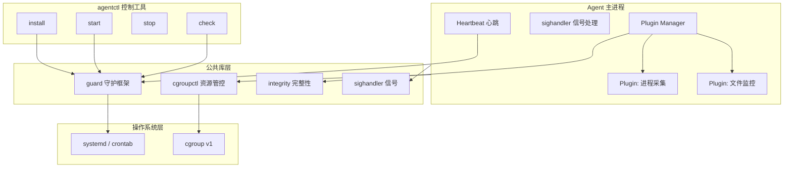

# 基于 Elkeid 剥离库构建自定义安全 Agent -- 开发实战

> 日期：2026-03-25
> 前置文档：elkeid_process_stability_analysis_2026-03-24.md

---

## 1. 项目总览

本示例将基于从 Elkeid 剥离的四个公共库，实现一个**完整可运行的安全 Agent**：

```
my-security-agent/
├── go.mod
├── cmd/
│   ├── agent/                # Agent 主进程
│   │   └── main.go
│   └── agentctl/             # 控制工具（install/start/stop/check）
│       └── main.go
├── internal/
│   ├── config/               # 配置管理
│   │   └── config.go
│   ├── heartbeat/            # 心跳上报
│   │   └── heartbeat.go
│   ├── collector/            # 数据采集模块（插件管理器）
│   │   └── collector.go
│   └── plugin/               # 插件生命周期管理
│       └── manager.go
├── pkg/                      # 从 Elkeid 剥离的公共库
│   ├── guard/                # 进程守护框架
│   │   ├── guard.go
│   │   ├── systemd.go
│   │   ├── sysvinit.go
│   │   └── pidlock.go
│   ├── cgroupctl/            # cgroup 资源管控
│   │   └── cgroup.go
│   ├── integrity/            # 二进制完整性校验
│   │   └── verify.go
│   └── sighandler/           # 信号处理框架
│       └── handler.go
└── deploy/
    └── install.sh            # 一键部署脚本
```

架构图：



---

## 2. 公共库实现

### 2.1 pkg/guard/guard.go -- 进程守护框架

```go
package guard

import (
	"fmt"
	"os"
	"os/exec"
	"path/filepath"
	"syscall"
	"text/template"
	"time"

	"github.com/coreos/go-systemd/daemon"
	"github.com/nightlyone/lockfile"
)

// ServiceConfig 服务配置
type ServiceConfig struct {
	Name            string // 服务名，如 "my-security-agent"
	Description     string
	ExecPath        string // 可执行文件绝对路径
	WorkingDir      string // 工作目录
	RestartPolicy   string // "always" | "on-failure" | "no"
	RestartDelaySec int    // 重启间隔秒数
	MemoryMax       string // 如 "250M"
	CPUQuota        string // 如 "10%"
	WatchdogSec     int    // watchdog 超时秒数，0=不启用
	EnvFile         string // 环境变量文件
	DelegateSubTree bool   // 是否允许创建子 cgroup
}

type GuardType int

const (
	GuardSystemd  GuardType = iota
	GuardSysvinit
)

type Guard struct {
	Config    ServiceConfig
	Type      GuardType
	pidLock   lockfile.Lockfile
	hasPidLck bool
}

// New 自动检测系统初始化方式
func New(cfg ServiceConfig) *Guard {
	g := &Guard{Config: cfg}
	if _, err := exec.LookPath("systemctl"); err == nil {
		g.Type = GuardSystemd
	} else {
		g.Type = GuardSysvinit
	}
	return g
}

// NewWithType 手动指定守护类型
func NewWithType(cfg ServiceConfig, t GuardType) *Guard {
	return &Guard{Config: cfg, Type: t}
}

func (g *Guard) Install() error {
	switch g.Type {
	case GuardSystemd:
		return g.installSystemd()
	case GuardSysvinit:
		return g.installSysvinit()
	}
	return fmt.Errorf("unsupported guard type")
}

func (g *Guard) Start() error {
	switch g.Type {
	case GuardSystemd:
		return run("systemctl", "start", g.Config.Name)
	case GuardSysvinit:
		return g.sysvinitStart()
	}
	return nil
}

func (g *Guard) Stop() error {
	switch g.Type {
	case GuardSystemd:
		return run("systemctl", "stop", g.Config.Name)
	case GuardSysvinit:
		return g.sysvinitStop()
	}
	return nil
}

func (g *Guard) Restart() error {
	switch g.Type {
	case GuardSystemd:
		return run("systemctl", "restart", g.Config.Name)
	case GuardSysvinit:
		_ = g.sysvinitStop()
		return g.sysvinitStart()
	}
	return nil
}

func (g *Guard) Uninstall() error {
	_ = g.Stop()
	switch g.Type {
	case GuardSystemd:
		run("systemctl", "disable", g.Config.Name)
		svcPath := filepath.Join(filepath.Dir(g.Config.ExecPath), g.Config.Name+".service")
		os.Remove(svcPath)
		run("systemctl", "daemon-reload")
	case GuardSysvinit:
		g.removeCrontab()
		os.Remove(filepath.Join("/etc/init.d/", g.Config.Name))
	}
	return nil
}

// Check 健康检查（由 crontab 每分钟调用）
// 检测 pid 文件是否有效，无效则重启
func (g *Guard) Check(pidFile string) error {
	if g.Type != GuardSysvinit {
		return nil
	}
	lf, err := lockfile.New(pidFile)
	if err != nil {
		return g.sysvinitStart()
	}
	if _, err := lf.GetOwner(); err != nil {
		return g.sysvinitStart()
	}
	return nil
}

// EnsureSingleInstance 确保单实例（Agent main 中调用）
func (g *Guard) EnsureSingleInstance(pidFile string) error {
	if g.Type != GuardSysvinit {
		return nil
	}
	lf, err := lockfile.New(pidFile)
	if err != nil {
		return fmt.Errorf("invalid pid file path: %w", err)
	}
	if err := lf.TryLock(); err != nil {
		return fmt.Errorf("another instance is running: %w", err)
	}
	g.pidLock = lf
	g.hasPidLck = true
	return nil
}

// ReleaseLock 释放 pid 文件锁
func (g *Guard) ReleaseLock() {
	if g.hasPidLck {
		g.pidLock.Unlock()
	}
}

// NotifyWatchdog 向 systemd 发送 watchdog 心跳
func NotifyWatchdog() {
	daemon.SdNotify(false, "WATCHDOG=1")
}

// NotifyReady 通知 systemd 服务已就绪
func NotifyReady() {
	daemon.SdNotify(false, "READY=1")
}

// ---- systemd 实现 ----

const systemdTemplate = `[Unit]
Description={{.Description}}
Wants=network-online.target
After=network-online.target network.target syslog.target

[Service]
Type=simple
ExecStart={{.ExecPath}}
WorkingDirectory={{.WorkingDir}}
Restart={{.RestartPolicy}}
RestartSec={{.RestartDelaySec}}
KillMode=control-group
{{- if .MemoryMax}}
MemoryMax={{.MemoryMax}}
MemoryLimit={{.MemoryMax}}
{{- end}}
{{- if .CPUQuota}}
CPUQuota={{.CPUQuota}}
{{- end}}
{{- if .DelegateSubTree}}
Delegate=yes
{{- end}}
{{- if gt .WatchdogSec 0}}
WatchdogSec={{.WatchdogSec}}
{{- end}}
{{- if .EnvFile}}
EnvironmentFile=-{{.EnvFile}}
{{- end}}

[Install]
WantedBy=multi-user.target
`

func (g *Guard) installSystemd() error {
	svcPath := filepath.Join(filepath.Dir(g.Config.ExecPath), g.Config.Name+".service")
	tmpl, err := template.New("svc").Parse(systemdTemplate)
	if err != nil {
		return err
	}
	f, err := os.OpenFile(svcPath, os.O_CREATE|os.O_WRONLY|os.O_TRUNC, 0644)
	if err != nil {
		return err
	}
	defer f.Close()
	if err := tmpl.Execute(f, g.Config); err != nil {
		return err
	}
	if err := run("systemctl", "enable", svcPath); err != nil {
		return fmt.Errorf("systemctl enable: %w", err)
	}
	run("systemctl", "daemon-reload")
	return nil
}

// ---- sysvinit 实现 ----

func (g *Guard) installSysvinit() error {
	script := fmt.Sprintf(`#!/bin/sh
### BEGIN INIT INFO
# Provides:             %s
# Required-Start:       $local_fs $network $syslog
# Required-Stop:        $local_fs $network $syslog
# Default-Start:        2 3 4 5
# Default-Stop:         0 1 6
### END INIT INFO
CTL="%s"
case "$1" in
    start)   "${CTL}" start ;;
    stop)    "${CTL}" stop ;;
    restart) "${CTL}" restart ;;
    *) echo "Usage: $0 {start|stop|restart}" && exit 1 ;;
esac
exit 0
`, g.Config.Name, filepath.Join(g.Config.WorkingDir, g.Config.Name+"ctl"))

	initPath := filepath.Join("/etc/init.d/", g.Config.Name)
	if err := os.WriteFile(initPath, []byte(script), 0755); err != nil {
		return err
	}
	if _, err := exec.LookPath("update-rc.d"); err == nil {
		run("update-rc.d", g.Config.Name, "defaults")
	} else if _, err := exec.LookPath("chkconfig"); err == nil {
		run("chkconfig", "--add", g.Config.Name)
	}
	return nil
}

func (g *Guard) sysvinitStart() error {
	cmd := exec.Command(g.Config.ExecPath)
	cmd.Dir = g.Config.WorkingDir
	cmd.SysProcAttr = &syscall.SysProcAttr{Setpgid: true}
	cmd.Env = append(os.Environ(), "service_type=sysvinit")
	if err := cmd.Start(); err != nil {
		return err
	}
	g.installCrontab()
	return nil
}

func (g *Guard) sysvinitStop() error {
	g.removeCrontab()
	pidFile := fmt.Sprintf("/var/run/%s.pid", g.Config.Name)
	lf, err := lockfile.New(pidFile)
	if err != nil {
		return nil
	}
	p, err := lf.GetOwner()
	if err != nil {
		return nil
	}
	_ = syscall.Kill(-p.Pid, syscall.SIGTERM)
	deadline := time.After(30 * time.Second)
	tick := time.NewTicker(200 * time.Millisecond)
	defer tick.Stop()
	for {
		select {
		case <-tick.C:
			if err := p.Signal(os.Signal(syscall.Signal(0))); err != nil {
				return nil
			}
		case <-deadline:
			_ = syscall.Kill(-p.Pid, syscall.SIGKILL)
			return nil
		}
	}
}

func (g *Guard) installCrontab() {
	content := fmt.Sprintf("* * * * * root %s check\n",
		filepath.Join(g.Config.WorkingDir, g.Config.Name+"ctl"))
	crontabFile := filepath.Join("/etc/cron.d/", g.Config.Name)
	os.WriteFile(crontabFile, []byte(content), 0600)
	run("service", "cron", "restart")
	run("service", "crond", "restart")
}

func (g *Guard) removeCrontab() {
	os.RemoveAll(filepath.Join("/etc/cron.d/", g.Config.Name))
	run("service", "cron", "restart")
	run("service", "crond", "restart")
}

func run(name string, args ...string) error {
	cmd := exec.Command(name, args...)
	cmd.Stdout = os.Stdout
	cmd.Stderr = os.Stderr
	return cmd.Run()
}
```

### 2.2 pkg/cgroupctl/cgroup.go -- cgroup 资源管控

```go
package cgroupctl

import (
	"bufio"
	"errors"
	"fmt"
	"os"
	"os/exec"
	"path/filepath"
	"strconv"
	"strings"
	"syscall"
)

type Limits struct {
	CPUQuotaPercent int   // CPU 配额百分比
	MemoryLimitMB   int64 // 内存上限 MB
}

type CGroup struct {
	name       string
	cpuPath    string
	memoryPath string
	namedPath  string
}

// New 创建 cgroup 并设置资源限制
func New(name string, limits Limits) (*CGroup, error) {
	if name == "" {
		return nil, errors.New("cgroup name is required")
	}
	namedRoot, cpuRoot, memRoot, cpuOK, memOK := findMountPoints()
	cg := &CGroup{name: name}

	// named cgroup
	if namedRoot == "" {
		namedRoot = "/tmp/cgroup_named"
		os.MkdirAll(namedRoot, 0700)
		exec.Command("mount", "-t", "cgroup", "-o", "none,name=all", "cgroup", namedRoot).Run()
	}
	cg.namedPath = filepath.Join(namedRoot, name)
	os.MkdirAll(cg.namedPath, 0700)

	// cpu
	if cpuOK && limits.CPUQuotaPercent > 0 {
		cg.cpuPath = filepath.Join(cpuRoot, name)
		os.MkdirAll(cg.cpuPath, 0700)
		period := readInt(filepath.Join(cg.cpuPath, "cpu.cfs_period_us"), 100000)
		quota := int64(period) * int64(limits.CPUQuotaPercent) / 100
		if quota < 10000 {
			quota = 10000
		}
		writeInt(filepath.Join(cg.cpuPath, "cpu.cfs_quota_us"), quota)
	}

	// memory
	if memOK && limits.MemoryLimitMB > 0 {
		cg.memoryPath = filepath.Join(memRoot, name)
		os.MkdirAll(cg.memoryPath, 0700)
		writeInt(filepath.Join(cg.memoryPath, "memory.limit_in_bytes"),
			limits.MemoryLimitMB*1024*1024)
	}

	return cg, nil
}

// AddProcess 将 pid 加入 cgroup
func (cg *CGroup) AddProcess(pid int) error {
	data := []byte(strconv.Itoa(pid))
	if cg.namedPath != "" {
		if err := retryWrite(filepath.Join(cg.namedPath, "cgroup.procs"), data); err != nil {
			return fmt.Errorf("named: %w", err)
		}
	}
	if cg.cpuPath != "" {
		if err := retryWrite(filepath.Join(cg.cpuPath, "cgroup.procs"), data); err != nil {
			return fmt.Errorf("cpu: %w", err)
		}
	}
	if cg.memoryPath != "" {
		if err := retryWrite(filepath.Join(cg.memoryPath, "cgroup.procs"), data); err != nil {
			return fmt.Errorf("memory: %w", err)
		}
	}
	return nil
}

// Destroy 删除 cgroup 目录
func (cg *CGroup) Destroy() {
	for _, p := range []string{cg.namedPath, cg.cpuPath, cg.memoryPath} {
		if p != "" {
			os.Remove(p)
		}
	}
}

func findMountPoints() (named, cpu, mem string, cpuOK, memOK bool) {
	f, err := os.Open("/proc/cgroups")
	if err != nil {
		return
	}
	s := bufio.NewScanner(f)
	for s.Scan() {
		fields := strings.Fields(s.Text())
		if len(fields) >= 4 {
			if fields[0] == "cpu" && fields[3] == "1" {
				cpuOK = true
			}
			if fields[0] == "memory" && fields[3] == "1" {
				memOK = true
			}
		}
	}
	f.Close()

	f, _ = os.Open("/proc/self/mountinfo")
	if f == nil {
		return
	}
	s = bufio.NewScanner(f)
	for s.Scan() {
		fields := strings.Fields(s.Text())
		if len(fields) < 10 {
			continue
		}
		if fields[len(fields)-3] == "cgroup" {
			for _, sub := range strings.Split(fields[len(fields)-1], ",") {
				switch sub {
				case "cpu":
					cpu = fields[4]
				case "memory":
					mem = fields[4]
				case "name=all":
					named = fields[4]
				}
			}
		}
	}
	f.Close()
	return
}

func retryWrite(path string, data []byte) error {
	for {
		err := os.WriteFile(path, data, 0644)
		if err == nil || !errors.Is(err, syscall.EINTR) {
			return err
		}
	}
}

func readInt(path string, def int64) int64 {
	data, err := os.ReadFile(path)
	if err != nil {
		return def
	}
	v, err := strconv.ParseInt(strings.TrimSpace(string(data)), 10, 64)
	if err != nil {
		return def
	}
	return v
}

func writeInt(path string, val int64) {
	retryWrite(path, []byte(strconv.FormatInt(val, 10)))
}
```

### 2.3 pkg/integrity/verify.go -- 完整性校验

```go
package integrity

import (
	"bytes"
	"context"
	"crypto/sha256"
	"encoding/hex"
	"errors"
	"fmt"
	"io"
	"net"
	"net/http"
	"os"
	"path/filepath"
	"time"
)

var ErrHashMismatch = errors.New("hash mismatch")

// VerifyFile 校验文件 SHA-256
func VerifyFile(path, expectedHex string) error {
	if expectedHex == "" {
		return errors.New("expected hash is empty")
	}
	expected, err := hex.DecodeString(expectedHex)
	if err != nil {
		return fmt.Errorf("invalid hex: %w", err)
	}
	f, err := os.Open(path)
	if err != nil {
		return err
	}
	defer f.Close()
	h := sha256.New()
	if _, err := io.Copy(h, f); err != nil {
		return err
	}
	if !bytes.Equal(h.Sum(nil), expected) {
		return ErrHashMismatch
	}
	return nil
}

// ComputeHash 计算文件 SHA-256
func ComputeHash(path string) (string, error) {
	f, err := os.Open(path)
	if err != nil {
		return "", err
	}
	defer f.Close()
	h := sha256.New()
	if _, err := io.Copy(h, f); err != nil {
		return "", err
	}
	return hex.EncodeToString(h.Sum(nil)), nil
}

// DownloadConfig 下载配置
type DownloadConfig struct {
	URLs         []string
	ExpectedHash string
	MaxSize      int64
	Timeout      time.Duration
}

// DownloadVerified 下载文件并校验 SHA-256
func DownloadVerified(ctx context.Context, dst string, cfg DownloadConfig) error {
	if err := VerifyFile(dst, cfg.ExpectedHash); err == nil {
		return nil
	}
	os.MkdirAll(filepath.Dir(dst), 0701)
	if cfg.MaxSize == 0 {
		cfg.MaxSize = 512 * 1024 * 1024
	}
	if cfg.Timeout == 0 {
		cfg.Timeout = 10 * time.Minute
	}
	client := &http.Client{
		Transport: &http.Transport{
			DialContext: (&net.Dialer{Timeout: 15 * time.Second}).DialContext,
		},
		Timeout: cfg.Timeout,
	}
	var lastErr error
	for _, url := range cfg.URLs {
		subCtx, cancel := context.WithCancel(ctx)
		req, err := http.NewRequestWithContext(subCtx, "GET", url, nil)
		if err != nil {
			cancel()
			lastErr = err
			continue
		}
		resp, err := client.Do(req)
		if err != nil {
			cancel()
			lastErr = err
			continue
		}
		if resp.StatusCode < 200 || resp.StatusCode >= 300 {
			resp.Body.Close()
			cancel()
			lastErr = fmt.Errorf("HTTP %s", resp.Status)
			continue
		}
		body := http.MaxBytesReader(nil, resp.Body, cfg.MaxSize)
		h := sha256.New()
		r := io.TeeReader(body, h)
		f, err := os.OpenFile(dst, os.O_CREATE|os.O_WRONLY|os.O_TRUNC, 0700)
		if err != nil {
			resp.Body.Close()
			cancel()
			return err
		}
		_, err = io.Copy(f, r)
		f.Close()
		resp.Body.Close()
		cancel()
		if err != nil {
			lastErr = err
			continue
		}
		actual := hex.EncodeToString(h.Sum(nil))
		if actual != cfg.ExpectedHash {
			os.Remove(dst)
			lastErr = fmt.Errorf("%w: got %s want %s", ErrHashMismatch, actual, cfg.ExpectedHash)
			continue
		}
		return nil
	}
	return fmt.Errorf("all URLs failed: %w", lastErr)
}
```

### 2.4 pkg/sighandler/handler.go -- 信号处理框架

```go
package sighandler

import (
	"context"
	"net"
	"net/http"
	_ "net/http/pprof"
	"os"
	"os/signal"
	"runtime/debug"
	"sync"
	"syscall"
	"time"
)

type Config struct {
	ShutdownDelay      time.Duration     // SIGTERM 后延迟退出时间
	OnShutdown         func()            // 关闭回调
	EnableDynamicPprof bool              // SIGUSR1 开关 pprof
	EnableMemRelease   bool              // SIGUSR2 释放内存
	CustomHandlers     map[syscall.Signal]func()
}

type Handler struct {
	cfg      Config
	cancel   context.CancelFunc
	listener net.Listener
	mu       sync.Mutex
}

// Setup 初始化信号处理，返回 context（SIGTERM 后会取消）
func Setup(cfg Config) (context.Context, *Handler) {
	ctx, cancel := context.WithCancel(context.Background())
	h := &Handler{cfg: cfg, cancel: cancel}

	sigs := make(chan os.Signal, 1)
	sigList := []os.Signal{syscall.SIGTERM}
	if cfg.EnableDynamicPprof {
		sigList = append(sigList, syscall.SIGUSR1)
	}
	if cfg.EnableMemRelease {
		sigList = append(sigList, syscall.SIGUSR2)
	}
	for s := range cfg.CustomHandlers {
		sigList = append(sigList, s)
	}
	signal.Notify(sigs, sigList...)

	go func() {
		for sig := range sigs {
			switch sig {
			case syscall.SIGTERM:
				if cfg.OnShutdown != nil {
					cfg.OnShutdown()
				}
				if cfg.ShutdownDelay > 0 {
					time.Sleep(cfg.ShutdownDelay)
				}
				cancel()
				return
			case syscall.SIGUSR1:
				h.togglePprof()
			case syscall.SIGUSR2:
				debug.FreeOSMemory()
			default:
				if fn, ok := cfg.CustomHandlers[sig.(syscall.Signal)]; ok {
					fn()
				}
			}
		}
	}()
	return ctx, h
}

func (h *Handler) togglePprof() {
	h.mu.Lock()
	defer h.mu.Unlock()
	if h.listener == nil {
		l, err := net.Listen("tcp", "127.0.0.1:0")
		if err != nil {
			return
		}
		h.listener = l
		go http.Serve(l, nil)
	} else {
		h.listener.Close()
		h.listener = nil
	}
}

// PprofAddr 返回 pprof 地址
func (h *Handler) PprofAddr() string {
	h.mu.Lock()
	defer h.mu.Unlock()
	if h.listener != nil {
		return h.listener.Addr().String()
	}
	return ""
}
```

---

## 3. Agent 主进程实现

### 3.1 cmd/agent/main.go

```go
package main

import (
	"fmt"
	"log"
	"os"
	"runtime"
	"sync"
	"time"

	"my-security-agent/internal/collector"
	"my-security-agent/internal/config"
	"my-security-agent/internal/heartbeat"
	"my-security-agent/pkg/cgroupctl"
	"my-security-agent/pkg/guard"
	"my-security-agent/pkg/sighandler"
)

var (
	Version = "1.0.0" // 编译时通过 -ldflags 注入
)

func init() {
	runtime.GOMAXPROCS(4)
}

func main() {
	// ---- 1. 加载配置 ----
	cfg := config.Load()

	// ---- 2. 初始化守护框架（单实例检查） ----
	g := guard.New(guard.ServiceConfig{
		Name:       cfg.ServiceName,
		ExecPath:   cfg.ExecPath,
		WorkingDir: cfg.WorkDir,
	})
	if err := g.EnsureSingleInstance(cfg.PidFile); err != nil {
		log.Fatalf("single instance check failed: %v", err)
	}
	defer g.ReleaseLock()

	// ---- 3. 信号处理 ----
	ctx, sigH := sighandler.Setup(sighandler.Config{
		ShutdownDelay:      5 * time.Second,
		OnShutdown:         func() { log.Println("[AGENT] received SIGTERM, shutting down...") },
		EnableDynamicPprof: true,
		EnableMemRelease:   true,
	})

	log.Printf("[AGENT] starting version=%s pid=%d", Version, os.Getpid())

	// ---- 4. cgroup 资源限制（sysvinit 场景下生效） ----
	if os.Getenv("service_type") == "sysvinit" {
		cg, err := cgroupctl.New(cfg.ServiceName, cgroupctl.Limits{
			CPUQuotaPercent: 10,
			MemoryLimitMB:   250,
		})
		if err != nil {
			log.Printf("[AGENT] warning: cgroup setup failed: %v", err)
		} else {
			if err := cg.AddProcess(os.Getpid()); err != nil {
				log.Printf("[AGENT] warning: cgroup add process failed: %v", err)
			}
			defer cg.Destroy()
		}
	}

	// ---- 5. 启动各模块 ----
	wg := &sync.WaitGroup{}

	// 5a. 心跳模块
	wg.Add(1)
	go func() {
		defer wg.Done()
		heartbeat.Run(ctx, cfg)
	}()

	// 5b. 数据采集模块（插件管理器）
	wg.Add(1)
	go func() {
		defer wg.Done()
		collector.Run(ctx, cfg)
	}()

	// ---- 6. 等待所有模块退出 ----
	wg.Wait()

	_ = sigH // 保持引用
	log.Println("[AGENT] exited gracefully")
}
```

### 3.2 internal/config/config.go

```go
package config

import (
	"os"
	"path/filepath"
)

type Config struct {
	ServiceName string
	WorkDir     string
	ExecPath    string
	PidFile     string

	// 心跳配置
	HeartbeatInterval int // 秒
	ServerAddr        string

	// 插件配置
	Plugins []PluginConfig
}

type PluginConfig struct {
	Name         string
	Version      string
	ExecPath     string   // 插件二进制路径
	Sha256       string   // 期望的 SHA-256
	DownloadURLs []string // 下载地址
}

func Load() *Config {
	workDir, _ := os.Getwd()
	execPath, _ := os.Executable()

	return &Config{
		ServiceName:       "my-security-agent",
		WorkDir:           workDir,
		ExecPath:          execPath,
		PidFile:           "/var/run/my-security-agent.pid",
		HeartbeatInterval: 60,
		ServerAddr:        "127.0.0.1:8443",
		Plugins: []PluginConfig{
			{
				Name:    "process-collector",
				Version: "1.0.0",
				ExecPath: filepath.Join(workDir, "plugins", "process-collector",
					"process-collector"),
				Sha256:       "", // 生产环境需设置
				DownloadURLs: []string{},
			},
		},
	}
}
```

### 3.3 internal/heartbeat/heartbeat.go

```go
package heartbeat

import (
	"context"
	"log"
	"os"
	"runtime"
	"strconv"
	"time"

	"my-security-agent/internal/config"
	"my-security-agent/pkg/guard"

	"github.com/shirou/gopsutil/v3/cpu"
	"github.com/shirou/gopsutil/v3/mem"
	"github.com/shirou/gopsutil/v3/process"
)

func Run(ctx context.Context, cfg *config.Config) {
	log.Println("[HEARTBEAT] started")
	defer log.Println("[HEARTBEAT] stopped")

	collect(cfg)

	ticker := time.NewTicker(time.Duration(cfg.HeartbeatInterval) * time.Second)
	defer ticker.Stop()

	for {
		select {
		case <-ctx.Done():
			return
		case <-ticker.C:
			collect(cfg)
			guard.NotifyWatchdog()
		}
	}
}

func collect(cfg *config.Config) {
	pid := os.Getpid()
	p, err := process.NewProcess(int32(pid))
	if err != nil {
		log.Printf("[HEARTBEAT] error: %v", err)
		return
	}

	cpuPct, _ := p.CPUPercent()
	memInfo, _ := p.MemoryInfo()
	fds, _ := p.NumFDs()

	var rss uint64
	if memInfo != nil {
		rss = memInfo.RSS
	}

	cpuUsage := float64(0)
	if pcts, err := cpu.Percent(0, false); err == nil && len(pcts) > 0 {
		cpuUsage = pcts[0]
	}
	memUsage := float64(0)
	if m, err := mem.VirtualMemory(); err == nil {
		memUsage = m.UsedPercent
	}

	log.Printf("[HEARTBEAT] pid=%d cpu=%.2f%% rss=%s fds=%d goroutines=%d "+
		"host_cpu=%.1f%% host_mem=%.1f%%",
		pid,
		cpuPct,
		formatBytes(rss),
		fds,
		runtime.NumGoroutine(),
		cpuUsage,
		memUsage,
	)
}

func formatBytes(b uint64) string {
	const unit = 1024
	if b < unit {
		return strconv.FormatUint(b, 10) + "B"
	}
	div, exp := uint64(unit), 0
	for n := b / unit; n >= unit; n /= unit {
		div *= unit
		exp++
	}
	return strconv.FormatFloat(float64(b)/float64(div), 'f', 1, 64) +
		string([]byte{'K', 'M', 'G', 'T'}[exp])
}
```

### 3.4 internal/plugin/manager.go -- 插件生命周期管理

```go
package plugin

import (
	"bufio"
	"context"
	"encoding/binary"
	"fmt"
	"io"
	"log"
	"os"
	"os/exec"
	"sync"
	"syscall"
	"time"

	"my-security-agent/internal/config"
	"my-security-agent/pkg/integrity"
)

// Plugin 表示一个运行中的插件
type Plugin struct {
	Name    string
	Version string
	cmd     *exec.Cmd
	rxPipe  *os.File // agent 从插件读数据
	txPipe  *os.File // agent 向插件写数据
	reader  *bufio.Reader
	done    chan struct{}
	mu      sync.Mutex
}

// Manager 管理所有插件
type Manager struct {
	plugins map[string]*Plugin
	mu      sync.RWMutex
}

func NewManager() *Manager {
	return &Manager{plugins: make(map[string]*Plugin)}
}

// LoadPlugin 加载单个插件：校验完整性 -> 启动子进程 -> 建立 pipe 通信
func (m *Manager) LoadPlugin(ctx context.Context, cfg config.PluginConfig) error {
	// ---- 1. 完整性校验 ----
	if cfg.Sha256 != "" {
		if err := integrity.VerifyFile(cfg.ExecPath, cfg.Sha256); err != nil {
			log.Printf("[PLUGIN:%s] local binary integrity check failed: %v", cfg.Name, err)
			if len(cfg.DownloadURLs) > 0 {
				log.Printf("[PLUGIN:%s] downloading from remote...", cfg.Name)
				if err := integrity.DownloadVerified(ctx, cfg.ExecPath, integrity.DownloadConfig{
					URLs:         cfg.DownloadURLs,
					ExpectedHash: cfg.Sha256,
				}); err != nil {
					return fmt.Errorf("download plugin %s failed: %w", cfg.Name, err)
				}
			} else {
				return fmt.Errorf("plugin %s integrity check failed and no download URLs", cfg.Name)
			}
		}
		log.Printf("[PLUGIN:%s] integrity check passed", cfg.Name)
	}

	// ---- 2. 创建 pipe 通信管道 ----
	// agent_rx_r <-- plugin 写入 (rx_w 传给插件作为 fd4)
	// agent_tx_w --> plugin 读取 (tx_r 传给插件作为 fd3)
	agentRxR, agentRxW, err := os.Pipe()
	if err != nil {
		return fmt.Errorf("create rx pipe: %w", err)
	}
	agentTxR, agentTxW, err := os.Pipe()
	if err != nil {
		return fmt.Errorf("create tx pipe: %w", err)
	}

	// ---- 3. 启动子进程 ----
	cmd := exec.CommandContext(ctx, cfg.ExecPath)
	cmd.Dir = cfg.ExecPath[:len(cfg.ExecPath)-len(cfg.Name)-1]
	cmd.SysProcAttr = &syscall.SysProcAttr{Setpgid: true}
	cmd.ExtraFiles = []*os.File{agentTxR, agentRxW} // fd3=read, fd4=write

	errFile, _ := os.OpenFile(cfg.ExecPath+".stderr",
		os.O_CREATE|os.O_WRONLY|os.O_TRUNC, 0600)
	cmd.Stderr = errFile

	if err := cmd.Start(); err != nil {
		return fmt.Errorf("start plugin %s: %w", cfg.Name, err)
	}

	// 关闭传给子进程的那一端
	agentTxR.Close()
	agentRxW.Close()

	plg := &Plugin{
		Name:    cfg.Name,
		Version: cfg.Version,
		cmd:     cmd,
		rxPipe:  agentRxR,
		txPipe:  agentTxW,
		reader:  bufio.NewReaderSize(agentRxR, 128*1024),
		done:    make(chan struct{}),
	}

	// ---- 4. 监控子进程退出 ----
	go func() {
		err := cmd.Wait()
		if errFile != nil {
			errFile.Close()
		}
		if err != nil {
			log.Printf("[PLUGIN:%s] exited with error: %v (code=%d)",
				plg.Name, err, cmd.ProcessState.ExitCode())
		} else {
			log.Printf("[PLUGIN:%s] exited normally (code=%d)",
				plg.Name, cmd.ProcessState.ExitCode())
		}
		close(plg.done)
	}()

	// ---- 5. 接收插件数据的 goroutine ----
	go func() {
		for {
			data, err := plg.receiveData()
			if err != nil {
				if err != io.EOF && err != io.ErrClosedPipe {
					log.Printf("[PLUGIN:%s] receive error: %v", plg.Name, err)
				}
				return
			}
			// 实际场景：将 data 发往服务端或写入 buffer
			log.Printf("[PLUGIN:%s] received %d bytes", plg.Name, len(data))
		}
	}()

	m.mu.Lock()
	m.plugins[cfg.Name] = plg
	m.mu.Unlock()

	log.Printf("[PLUGIN:%s] loaded pid=%d", cfg.Name, cmd.Process.Pid)
	return nil
}

// ShutdownPlugin 关闭插件：关 pipe -> 等 10 秒 -> SIGKILL
func (m *Manager) ShutdownPlugin(name string) {
	m.mu.Lock()
	plg, ok := m.plugins[name]
	if !ok {
		m.mu.Unlock()
		return
	}
	delete(m.plugins, name)
	m.mu.Unlock()

	plg.txPipe.Close()
	plg.rxPipe.Close()

	select {
	case <-time.After(10 * time.Second):
		log.Printf("[PLUGIN:%s] shutdown timeout, killing process group", name)
		syscall.Kill(-plg.cmd.Process.Pid, syscall.SIGKILL)
		<-plg.done
	case <-plg.done:
		log.Printf("[PLUGIN:%s] shutdown gracefully", name)
	}
}

// ShutdownAll 关闭所有插件
func (m *Manager) ShutdownAll() {
	m.mu.RLock()
	names := make([]string, 0, len(m.plugins))
	for name := range m.plugins {
		names = append(names, name)
	}
	m.mu.RUnlock()

	wg := &sync.WaitGroup{}
	for _, name := range names {
		wg.Add(1)
		go func(n string) {
			defer wg.Done()
			m.ShutdownPlugin(n)
		}(name)
	}
	wg.Wait()
}

// receiveData 从 pipe 读取一条插件数据（长度前缀协议）
func (plg *Plugin) receiveData() ([]byte, error) {
	var length uint32
	if err := binary.Read(plg.reader, binary.LittleEndian, &length); err != nil {
		return nil, err
	}
	buf := make([]byte, length)
	if _, err := io.ReadFull(plg.reader, buf); err != nil {
		return nil, err
	}
	return buf, nil
}

// SendTask 向插件发送一条任务（长度前缀协议）
func (plg *Plugin) SendTask(data []byte) error {
	plg.mu.Lock()
	defer plg.mu.Unlock()
	header := make([]byte, 4)
	binary.LittleEndian.PutUint32(header, uint32(len(data)))
	if _, err := plg.txPipe.Write(header); err != nil {
		return err
	}
	_, err := plg.txPipe.Write(data)
	return err
}
```

### 3.5 internal/collector/collector.go -- 数据采集模块

```go
package collector

import (
	"context"
	"log"

	"my-security-agent/internal/config"
	"my-security-agent/internal/plugin"
)

func Run(ctx context.Context, cfg *config.Config) {
	log.Println("[COLLECTOR] started")
	defer log.Println("[COLLECTOR] stopped")

	mgr := plugin.NewManager()

	// 加载所有配置的插件
	for _, pcfg := range cfg.Plugins {
		if err := mgr.LoadPlugin(ctx, pcfg); err != nil {
			log.Printf("[COLLECTOR] load plugin %s failed: %v", pcfg.Name, err)
		}
	}

	// 等待 context 取消（Agent 退出）
	<-ctx.Done()

	// 关闭所有插件
	log.Println("[COLLECTOR] shutting down all plugins...")
	mgr.ShutdownAll()
}
```

---

## 4. 控制工具 agentctl

### 4.1 cmd/agentctl/main.go

```go
package main

import (
	"fmt"
	"os"

	"my-security-agent/pkg/guard"
)

const (
	serviceName = "my-security-agent"
	workDir     = "/opt/my-security-agent"
	execPath    = "/opt/my-security-agent/my-security-agent"
	pidFile     = "/var/run/my-security-agent.pid"
)

func newGuard() *guard.Guard {
	return guard.New(guard.ServiceConfig{
		Name:            serviceName,
		Description:     "My Security Agent - Host Intrusion Detection",
		ExecPath:        execPath,
		WorkingDir:      workDir,
		RestartPolicy:   "always",
		RestartDelaySec: 30,
		MemoryMax:       "250M",
		CPUQuota:        "10%",
		WatchdogSec:     120,
		EnvFile:         workDir + "/env",
		DelegateSubTree: false,
	})
}

func main() {
	if len(os.Args) < 2 {
		usage()
		os.Exit(1)
	}

	g := newGuard()

	var err error
	switch os.Args[1] {
	case "install":
		err = g.Install()
		if err == nil {
			fmt.Println("[OK] service installed")
		}
	case "start":
		err = g.Start()
		if err == nil {
			fmt.Println("[OK] service started")
		}
	case "stop":
		err = g.Stop()
		if err == nil {
			fmt.Println("[OK] service stopped")
		}
	case "restart":
		err = g.Restart()
		if err == nil {
			fmt.Println("[OK] service restarted")
		}
	case "uninstall":
		err = g.Uninstall()
		if err == nil {
			fmt.Println("[OK] service uninstalled")
		}
	case "check":
		err = g.Check(pidFile)
	case "status":
		fmt.Printf("Guard type: %d (0=systemd, 1=sysvinit)\n", g.Type)
	default:
		usage()
		os.Exit(1)
	}

	if err != nil {
		fmt.Fprintf(os.Stderr, "[ERROR] %v\n", err)
		os.Exit(1)
	}
}

func usage() {
	fmt.Println("Usage: my-security-agentctl <command>")
	fmt.Println()
	fmt.Println("Commands:")
	fmt.Println("  install    Install service (systemd or sysvinit)")
	fmt.Println("  start      Start the agent")
	fmt.Println("  stop       Stop the agent")
	fmt.Println("  restart    Restart the agent")
	fmt.Println("  uninstall  Remove service")
	fmt.Println("  check      Health check (called by crontab)")
	fmt.Println("  status     Show guard type")
}
```

---

## 5. 示例插件：进程采集

这是一个独立编译的插件二进制，通过 pipe fd 与 Agent 通信。

### 5.1 plugins/process-collector/main.go

```go
package main

import (
	"encoding/binary"
	"encoding/json"
	"log"
	"os"
	"time"

	"github.com/shirou/gopsutil/v3/process"
)

// pipe fd 约定：fd3 = 从 agent 读任务, fd4 = 向 agent 写数据
var (
	readPipe  = os.NewFile(3, "pipe-read")
	writePipe = os.NewFile(4, "pipe-write")
)

type ProcessInfo struct {
	PID     int32  `json:"pid"`
	Name    string `json:"name"`
	Cmdline string `json:"cmdline"`
	User    string `json:"username"`
	PPID    int32  `json:"ppid"`
}

func main() {
	log.SetPrefix("[process-collector] ")
	log.Println("started")

	ticker := time.NewTicker(30 * time.Second)
	defer ticker.Stop()

	collectAndSend()

	for range ticker.C {
		collectAndSend()
	}
}

func collectAndSend() {
	procs, err := process.Processes()
	if err != nil {
		log.Printf("list processes error: %v", err)
		return
	}

	for _, p := range procs {
		name, _ := p.Name()
		cmdline, _ := p.Cmdline()
		username, _ := p.Username()
		ppid, _ := p.Ppid()

		info := ProcessInfo{
			PID:     p.Pid,
			Name:    name,
			Cmdline: cmdline,
			User:    username,
			PPID:    ppid,
		}

		data, err := json.Marshal(info)
		if err != nil {
			continue
		}
		sendData(data)
	}
	log.Printf("collected %d processes", len(procs))
}

func sendData(data []byte) {
	header := make([]byte, 4)
	binary.LittleEndian.PutUint32(header, uint32(len(data)))
	writePipe.Write(header)
	writePipe.Write(data)
}
```

---

## 6. 部署脚本

### 6.1 deploy/install.sh

```bash
#!/bin/bash
set -e

PRODUCT="my-security-agent"
INSTALL_DIR="/opt/${PRODUCT}"
CTL="${INSTALL_DIR}/${PRODUCT}ctl"

info()  { echo -e "\033[96m[INFO]\033[0m $1"; }
succ()  { echo -e "\033[92m[OK]\033[0m   $1"; }
error() { echo -e "\033[91m[ERR]\033[0m  $1"; exit 1; }

# 检查 root 权限
[ "$(id -u)" -ne 0 ] && error "must run as root"

# 创建安装目录
mkdir -p "${INSTALL_DIR}/plugins/process-collector"
mkdir -p "${INSTALL_DIR}/log"

# 复制二进制
cp -f ./my-security-agent "${INSTALL_DIR}/"
cp -f ./my-security-agentctl "${INSTALL_DIR}/${PRODUCT}ctl"
cp -f ./process-collector "${INSTALL_DIR}/plugins/process-collector/"
chmod 700 "${INSTALL_DIR}/${PRODUCT}"
chmod 700 "${CTL}"
chmod 700 "${INSTALL_DIR}/plugins/process-collector/process-collector"

# 创建软链接
ln -sf "${CTL}" /usr/local/bin/${PRODUCT}ctl

info "installing service..."
"${CTL}" install

info "starting agent..."
"${CTL}" start

succ "installation complete!"
echo
echo "Useful commands:"
echo "  ${PRODUCT}ctl status    - Check guard type"
echo "  ${PRODUCT}ctl restart   - Restart agent"
echo "  ${PRODUCT}ctl stop      - Stop agent"
echo "  ${PRODUCT}ctl uninstall - Remove service"
echo
echo "Debug commands:"
echo "  kill -USR1 \$(pidof ${PRODUCT})  - Toggle pprof"
echo "  kill -USR2 \$(pidof ${PRODUCT})  - Release memory"
echo "  journalctl -u ${PRODUCT} -f     - View logs (systemd)"
```

---

## 7. 编译与部署

### 7.1 Makefile

```makefile
PRODUCT := my-security-agent
VERSION := 1.0.0
LDFLAGS := -X main.Version=$(VERSION)

.PHONY: all agent ctl plugin clean

all: agent ctl plugin

agent:
	CGO_ENABLED=0 go build -ldflags "$(LDFLAGS)" -o $(PRODUCT) ./cmd/agent/

ctl:
	CGO_ENABLED=0 go build -o $(PRODUCT)ctl ./cmd/agentctl/

plugin:
	CGO_ENABLED=0 go build -o process-collector ./plugins/process-collector/

clean:
	rm -f $(PRODUCT) $(PRODUCT)ctl process-collector

install: all
	sudo bash deploy/install.sh
```

### 7.2 go.mod

```
module my-security-agent

go 1.21

require (
	github.com/coreos/go-systemd v0.0.0-20191104093116-d3cd4ed1dbcf
	github.com/nightlyone/lockfile v1.0.0
	github.com/shirou/gopsutil/v3 v3.24.1
)
```

### 7.3 完整编译和部署流程

```bash
# 1. 编译
make all

# 2. 计算插件 SHA-256（用于完整性校验配置）
sha256sum process-collector
# 输出: a1b2c3d4...  process-collector

# 3. 安装部署
sudo make install

# 4. 查看运行状态（systemd 模式）
systemctl status my-security-agent
# 或
journalctl -u my-security-agent -f

# 5. 运维操作
my-security-agentctl restart        # 重启
kill -USR1 $(pidof my-security-agent)  # 开启 pprof
kill -USR2 $(pidof my-security-agent)  # 释放内存

# 6. 卸载
my-security-agentctl uninstall
```

---

## 8. 各库在 Agent 中的作用映射

```
┌────────────────────────────────────────────────────────────────┐
│                       Agent 主进程 main.go                      │
│                                                                │
│  ┌──────────────────────────────────────────────────────────┐  │
│  │  sighandler.Setup()                                      │  │
│  │  ├── SIGTERM → 延迟 5 秒 → cancel context → 优雅退出     │  │
│  │  ├── SIGUSR1 → 动态开关 pprof                            │  │
│  │  └── SIGUSR2 → debug.FreeOSMemory()                      │  │
│  └──────────────────────────────────────────────────────────┘  │
│                                                                │
│  ┌───────────────────┐  ┌────────────────────────────────────┐│
│  │  guard 库          │  │  cgroupctl 库                      ││
│  │  ├── 单实例检查     │  │  ├── 创建 cgroup                  ││
│  │  └── pid 文件锁    │  │  ├── CPU 10% 限制                 ││
│  └───────────────────┘  │  ├── Memory 250MB 限制             ││
│                          │  └── 将 Agent pid 加入 cgroup      ││
│  ┌───────────────────┐  └────────────────────────────────────┘│
│  │  heartbeat 模块    │                                       │
│  │  ├── 每 60s 采集    │                                       │
│  │  ├── 上报状态       │                                       │
│  │  └── NotifyWatchdog │                                       │
│  └───────────────────┘                                        │
│                                                                │
│  ┌──────────────────────────────────────────────────────────┐ │
│  │  plugin.Manager（collector 模块）                          │ │
│  │  ├── integrity.VerifyFile() → SHA-256 校验插件            │ │
│  │  ├── 失败 → integrity.DownloadVerified() → 重新下载       │ │
│  │  ├── exec.Command + pipe fd 启动子进程                    │ │
│  │  ├── receiveData() 接收插件数据                           │ │
│  │  └── ShutdownPlugin() 关 pipe → 等 10s → SIGKILL         │ │
│  └──────────────────────────────────────────────────────────┘ │
└────────────────────────────────────────────────────────────────┘

┌────────────────────────────────────────────────────────────────┐
│                      agentctl 控制工具                          │
│  guard.New() → 自动检测 systemd / sysvinit                     │
│  ├── install  → 生成 .service 文件 / 注册 init.d + crontab    │
│  ├── start    → systemctl start / sysvinitStart               │
│  ├── stop     → systemctl stop / SIGTERM → SIGKILL            │
│  ├── check    → 检查 pid 文件 → 无效则重启（crontab 调用）     │
│  └── uninstall → 停止 + 移除 service 文件                     │
└────────────────────────────────────────────────────────────────┘
```

---

## 9. 关键设计决策说明

| 设计点 | 选择 | 原因 |
|--------|------|------|
| Agent ↔ Plugin 通信 | pipe fd（fd3/fd4） | 与 Elkeid 保持一致，无需网络端口，安全性高 |
| 插件独立进程组 | `Setpgid: true` | 可通过 `kill(-pgid)` 一次性终止插件及其子进程 |
| 资源限制双重保障 | systemd cgroup + 手动 cgroup | systemd 模式由 service 文件管控，sysvinit 模式手动创建 |
| 守护三重保障 | systemd + crontab + watchdog | 崩溃重启 + 定时拉活 + 僵死检测 |
| 完整性校验时机 | 插件加载前 | 运行前发现篡改，比运行后检测更安全 |
| SIGTERM 延迟退出 | 5 秒 | 给插件和网络连接留出优雅关闭时间 |

> 本示例忠实复现了 Elkeid Agent 的进程稳定性架构，所有设计模式均可追溯到 Elkeid 源码。公共库层完全业务无关，可直接复用到任何需要进程守护和资源管控的 Go 项目中。
